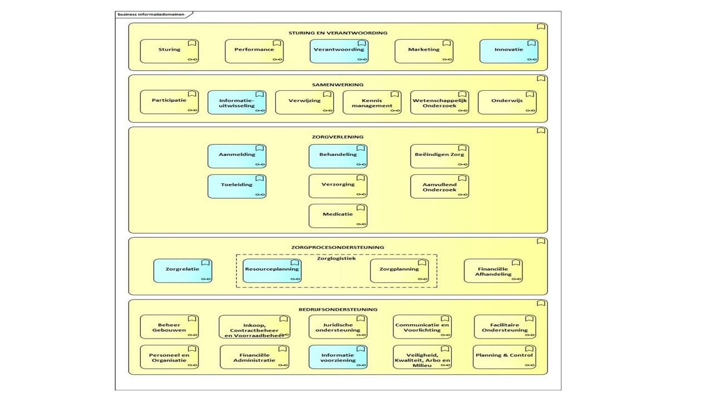

# Bedrijfsarchitectuur

## Koppeltaal

### Geestelijke zorgverlening, blended care en behandelplan

Koppeltaal integreert informatiestromen uit eHealth-modules, ROM \(Routine Outcome Measurement\) en EPD \(Elektronische Patiënten Dossier\) in de werkomgeving van de behandelaar en cliënt. Zo heeft de behandelaar direct een volledig en actueel beeld van hun cliënt in één omgeving. Daarnaast is het mogelijk voor behandelaren om hun cliënten toegang te geven tot specifieke eHealth-modules en interventies van uiteenlopende leveranciers.

Interoperabiliteit tussen de informatiesystemen is hier één van de belangrijke aspecten in de context van **blended care in de GGZ**. Bij blended care in de GGZ worden reguliere face-to-face gesprekken gecombineerd met **online interventies** zoals bijvoorbeeld chat, beeldbellen en **online behandelmodules**. Hierdoor kan een cliënt tijd- en plaats-onafhankelijk zorg gebruiken via een tablet of smartphone.

Een **behandelplan** beschrijft de gehele behandeling waar een blended care behandeling onderdeel van kan zijn. In dat plan worden verschillende **activiteiten** benoemd, veelal in een bepaalde volgorde. Deze activiteiten kunnen zijn, het samenstellen van het zorgteam, het bepalen van de doelen van een behandeling, het maken van een afspraak, het uitvoeren van een \(online\) interventie, het bespreken of bekijken van **voortgang**, **status**, **resultaten**, en het **evalueren** van de vooruitgang van de conditie van de Cliënt ten opzichte van de behandeldoelen. Voor zover deze activiteiten door een informatiesysteem worden ondersteund, is gegevensuitwisseling via Koppeltaal mogelijk.

Bij een blended care behandeling zijn tenminste een **cliënt** en een **behandelaar** betrokken. En steeds vaker ook **derden**, zoals vrienden, familie, lotgenoten, en ervaringsdeskundigen.

### Positie van Koppeltaal in het GGZ-referentiedomeinen model

In het door GGZ Nederland en Nictiz opgestelde GGZ Domein referentiemodel speelt Koppeltaal een mogelijke rol in de met blauwe aangeduide sub domeinen.

Koppeltaal helpt om behandeling te ondersteunen. Specifiek eHealth in blended care processen. Verder ondersteunt Koppeltaal de aanmeldingsprocessen via het synchroniseren van patiëntgegevens over verschillende applicaties. Daarnaast kan Koppeltaal \[in de toekomst\] een rol spelen in de resourceplanning, omdat er rond een behandelplan met Koppeltaal relaties gelegd kunnen worden tussen cliënt, behandelaar, en derden \(zoals familie, vrienden, ervaringsdeskundigen, etc.\).

Ten slotte kan Koppeltaal \[in de toekomst\] een rol spelen in de verantwoording en de innovatie. Via Koppeltaal kan informatie voor besturing verkregen worden over de inzet van eHealth in blended care processen geïntegreerd over verschillende applicaties heen. Daarnaast kan met Koppeltaal, de adoptie van eHealth onder cliënten en behandelaren versneld worden via de door Koppeltaal veroorloofde keuzevrijheid, flexibiliteit, en gebruikersgemak.

### Juridische kader

In de context van Koppeltaal spelen de volgende juridische concepten, relaties, en regels een rol:

* Behandelrelatie
* Contractuele relaties
* Gebruik van burgerservicenummer in de zorg
* AVG-normen

Behandelrelatie. Een behandelrelatie in het kader van de **Wet op de geneeskundige behandelingsovereenkomst** of **WGBO** wordt aangegaan door de GGZ-deelnemers van Koppeltaal. De verantwoordelijkheid voor de gegevensverwerking in de context van deze overeenkomst ligt bij de GGZ-deelnemers.

De GGZ-deelnemers van Koppeltaal hebben contractuele relaties met ICT-leveranciers die voor hen gegevens verwerken. Deze relatie wordt tevens via een verwerkersovereenkomst geregeld.

GGZ Gebruikers vragen hun IT-leveranciers gegevens uit te wisselen via Koppeltaal in de context van de behandelrelatie. IT-leveranciers worden hiervoor deelnemer in Koppeltaal en accepteren daartoe de IT-deelnemersvoorwaarden. Tevens sluiten ze met Koppeltaal een verwerkersovereenkomst.

Indien gebruik wordt gemaakt van het BSN bij gegevensuitwisseling, geldt ook de wet gebruik Burgerservicenummer in de zorg \(Wgbsn-z\). De wet gebruik Burgerservicenummer in de zorg verplicht zorgaanbieders het Burgerservicenummer \(BSN\) van hun patiënten vast te leggen in hun administratie. Met het BSN kan de identiteit van de patiënt zeker worden gesteld. In het geval een persoon \(patiënt\) zich voor het eerst tot een zorgverlener wendt, moet de zorgverlener bij het eerste fysieke contact het BSN verifiëren. Vervolgens valt de interactie tussen de persoon en zijn zorgverlener onder het vervolg van de verlening van zorg. Voor dit vervolg van de verlening van zorg mag het BSN worden verwerkt. IT-leveranciers kunnen het BSN opslaan onder de verantwoordelijkheid van de GGZ-deelnemers \(in het bijzonder EPD-leveranciers\), en gebruiken vervolgens een pseudoniem \(EPD-nummer\) bij gegevensuitwisseling via Koppeltaal ter referentie.

Via het privacy beleid van de GGZ-deelnemer, en de keten van verwerkersovereenkomsten zoals hierboven beschreven \(en de maatregelen die ten gevolge van die overeenkomsten in de deelnemende organisaties en de Koppeltaal keten worden ingevoerd\) voldoet Koppeltaal aan de AVG-normen.

## Scenario’s

Koppeltaal biedt via de standaard: flexibiliteit, keuzevrijheid en gebruiksgemak in blended care processen. Om te illustreren hoe de standaard dat doet beschrijven we hieronder twee voorbeeld scenario’s van verschillende blended care behandelingen. Een in de eerstelijns zorg en een in de gespecialiseerde GGZ zorg. De stappen in de scenario’s staan in de linker kolom beschreven, en in de rechterkolom staan Koppeltaal use cases die gebruikt worden in de ondersteuning van de betreffende stap in het proces.

| **Scenario** | **Scenario per stap** | **Use case** |
| :--- | :--- | :--- |
| 1 | Een cliënt meldt zich bij de huisarts met chronische spanning en hoofdpijn. De huisarts constateert dat er veel angst speelt bij deze cliënt en vraagt de praktijkondersteuner GGZ \(POH\) de cliënt te begeleiden. De POH opent de pagina van deze cliënt en kijkt in de lijst met beschikbare applicaties welke angstmodule de cliënt het best kan volgen. Ze ziet een geschikte module angst en spanning. | Beheerder heeft applicaties met daarbij behorende \(sub\)activiteiten in het Koppeltaal domein geregistreerd en daarmee zijn ze beschikbaar gesteld |
| 2 | Ze wijst deze module toe aan de cliënt. | Behandelplan starten en \(Sub\)activiteiten als onderdeel van het behandelplan selecteren en Participant \(Patiënt\) opvoeren in het behandelplan. |
| 3 | De cliënt ontvangt in de mail een uitnodiging voor toegang tot het cliëntportaal van de huisarts en logt in via een link. | Ontvangen inlogverzoek |
| 4 | In het cliëntportaal staat de module angst en spanning als een ‘blok’ klaar zoals besproken. De cliënt klikt op het blok en de module wordt geopend. De cliënt gaat aan de slag. De cliënt werkt een half uur aan de module en sluit deze na afronding af en gaat slapen. | \(Sub\)activiteit lanceren en Single Sign-On realiseren tussen interventie en de te lanceren \(sub\)activiteit. |
| 5 | De POH komt in de ochtend op kantoor en opent het cliënt dossier via het behandelaarsplatform. Ze ziet dat de cliënt de module heeft geopend, heeft afgerond en vervolgens heeft afgesloten. | \(Sub\)activiteit monitoren. |
| 6 | Ze klikt door naar de pagina van de cliënt en kan daar direct de scores van de app en de reflectie van de cliënt daarop lezen. | \(Sub\)activiteit evalueren. |
| 7 | Ze twijfelt of ze de reflectie van de cliënt op de afsluitende opdracht van de module goed begrijpt. Ze klikt door op het resultaat, daarmee wordt de module geopend en kan ze zien wat de cliënt precies gedaan heeft in de opdracht. Nu is ze goed voorbereid voor het gesprek van vanmiddag. | \(Sub\)activiteit evalueren door \(sub\)activiteit te lanceren. |

Tabel 1. Eerstelijns zorg scenario – Use-cases

In de specialistische GGZ zou Koppeltaal bijvoorbeeld in het volgende scenario ingezet kunnen worden:

| **Scenario** | **Scenario per stap** | **Use case** |
| :--- | :--- | :--- |
| 8 | Een cliënt is in gesprek met de psychiater. Er is complexe problematiek aan de orde, maar de problematiek is niet ernstig. Er kan behandeld worden met blended care. De psychiater kiest een passende ROM-vragenlijst om beter beeld te krijgen van de startsituatie van de behandeling. | Selecteer passende \(sub\)activiteit \(ROM-vragenlijst\) aan cliënt. |
| 9 | De cliënt ontvangt via de e-mail een uitnodiging om in te loggen | Ontvangen inlogverzoek. |
| 10 | De cliënt logt in en ziet een knop om de vragenlijst te starten. De cliënt klikt en de vragenlijst wordt geopend. De cliënt vult de lijst in, maar stopt halverwege. Te moeilijk. | Opstarten \(sub\)activiteit \(gedeeltelijk invullen ROM vragenlijst\) |
| 11 | De behandelaar krijgt melding dat cliënt geen voortgang toont in behandeling | \(Sub\)activiteit monitoren. |
| 12 | De cliënt geeft aan dat hij de vragenlijst moeilijk vindt en dat hij daarop afhaakt. Dat is onderdeel van het probleem waarom de cliënt in de eerste plaats kwam. In overleg besluiten behandelaar en cliënt een familielid bij te schakelen om te helpen. Het familielid kan dat op zijn eigen systeem zien wat de cliënt heeft ingevuld en daarop toelichting geven voor de behandelaar. De cliënt nodigt via het eHealthplatform zijn vrouw uit om mee te helpen. | Participant \(Derde\) opvoeren in het behandelplan. |
| 13 | De behandelaar krijgt een signaal dat er een relatie is toegevoegd aan de pagina van de cliënt. | Ontvangen signaal dat relatie is toegevoegd |
| 14 | Met behulp van zijn vrouw lukt het de client om de vragenlijst af te ronden. De behandelaar krijgt signaal van de afronding en bekijkt de resultaten ter voorbereiding op het volgende gesprek. | \(Sub\)activiteit evalueren |
| 15 | In gesprek besluiten cliënt en behandelaar voor maatwerk op het gebied van eHealth en monitoring. De cliënt gaat een app gebruiken om zelf doelen te stellen, te monitoren en met zijn familie en vrienden passende content voor zelfzorg te verzamelen. De behandelaar kent de betreffende app toe aan de cliënt. | Behandelplan starten en \(Sub\)activiteiten als onderdeel van het behandelplan selecteren. |
| 16 | De cliënt logt thuis in en ziet een code om de app te activeren en instructies om de app via de appstore te installeren op zijn iPhone. Hij gebruikt de code om de app te activeren. \(De app voor die gebruiker wordt aangemeld voor berichten van Koppeltaal\) | \(Sub\)activiteit lanceren \(met SSO\) |
| 17 | De behandelaar ziet met regelmaat status, voortgang en resultaten uit de app van de cliënt. | \(Sub\)activiteit monitoren. |
| 18 | Op een gegeven moment denkt de behandelaar aan een filmpje op internet waarvan hij denkt dat het behulpzaam kan zijn voor in de ‘rugzak’ van deze cliënt. Hij kopieert een link naar het filmpje in een bericht dat hij de cliënt stuurt. De cliënt opent de app in de ochtend en ziet daar een tip van zijn behandelaar. De cliënt bekijkt de tip en voegt deze toe aan zijn ‘rugzak’ in de app. | Algemene informatie uitwisselen |

Specialistische zorg scenario – Use-cases

Koppeltaal biedt de volgende **rollen** en **use-cases** aan om de scenario’s, zoals hierboven beschreven, mogelijk te maken.

## Rollen

* Beheerder. Degene die de applicaties\(interventies\) activeert en activiteiten beschikbaar stelt ten behoeve van een zorginstelling en zorgverleners.
* Patiënt. Degene die behandeld wordt.
* Behandelaar. Degene die de zorg aan de patiënt verleent.
* Derde. Degene die een niet zorg verlenende relatie hebben met de patiënt en ondersteuning biedt bij een behandeling, zoals vrienden, familie, lotgenoten, en ervaringsdeskundigen.

## Use-cases

### UC-KT-01 Applicatie registreren

<table>
  <thead>
    <tr>
      <th style="text-align:left">Use case</th>
      <th style="text-align:left">UC-KT-01</th>
    </tr>
  </thead>
  <tbody>
    <tr>
      <td style="text-align:left">Naam</td>
      <td style="text-align:left">Applicatie registreren</td>
    </tr>
    <tr>
      <td style="text-align:left">Scenario</td>
      <td style="text-align:left">
        <ul>
          <li>Scenario 1</li>
        </ul>
      </td>
    </tr>
    <tr>
      <td style="text-align:left">Beschrijving</td>
      <td style="text-align:left">Verschillende type applicaties per zorgbehoefte geregistreerd in het Koppeltaal
        domein ter ondersteuning van een interactief zorgproces.</td>
    </tr>
    <tr>
      <td style="text-align:left">Primaire actor</td>
      <td style="text-align:left">Beheerder</td>
    </tr>
    <tr>
      <td style="text-align:left">Onderwerp</td>
      <td style="text-align:left">Applicatie (interventie)</td>
    </tr>
    <tr>
      <td style="text-align:left">Pre-condities</td>
      <td style="text-align:left">Applicatie moet gecertificeerd zijn</td>
    </tr>
    <tr>
      <td style="text-align:left">Trigger</td>
      <td style="text-align:left">Beheerder is trigger en doet configuratie van zorgdomein</td>
    </tr>
    <tr>
      <td style="text-align:left">Procesflow</td>
      <td style="text-align:left"></td>
    </tr>
    <tr>
      <td style="text-align:left">Post-conditie</td>
      <td style="text-align:left">(Interventie) applicatie actief in zorgdomein</td>
    </tr>
    <tr>
      <td style="text-align:left">Opmerkingen</td>
      <td style="text-align:left">
        <ol>
          <li>Elke applicatie krijgt een Applicatie Identifier en naam.</li>
          <li>Een applicatie van het type &quot;<a href="woordenlijst.md#interventie">interventie</a>&quot;
            heeft:
            <ol>
              <li>een (unieke) locatie waar de interventie te vinden is (URL)</li>
              <li>Een overeengekomen beveiligingslocatie waar eenmalig geverifieerd wordt
                dat de aanroepende partij een bekende (en geregistreerde) partij is die
                kan worden vertrouwd (Single Sign-On) in een gegeven domein.</li>
            </ol>
          </li>
          <li>Elk geregistreerde applicatie krijgt &#xE9;&#xE9;n of meerdere functionele
            (applicatie) rollen in de context van blended care (zie &quot;<a href="informatiesystemen-architectuur.md#actoren-en-rollen">Actoren en rollen</a>&quot;).</li>
        </ol>
      </td>
    </tr>
  </tbody>
</table>

### UC-KT-02 \(Sub\)activiteiten registreren

<table>
  <thead>
    <tr>
      <th style="text-align:left">Use case</th>
      <th style="text-align:left">UC-KT-02</th>
    </tr>
  </thead>
  <tbody>
    <tr>
      <td style="text-align:left">Naam</td>
      <td style="text-align:left">(Sub)activiteiten registreren</td>
    </tr>
    <tr>
      <td style="text-align:left">Scenario</td>
      <td style="text-align:left">
        <ul>
          <li>Scenario 1</li>
        </ul>
      </td>
    </tr>
    <tr>
      <td style="text-align:left">Beschrijving</td>
      <td style="text-align:left">Per applicatie van het type &quot;interventie&quot; worden (sub)activiteiten
        definities geregistreerd, die aangeboden worden op basis van aandoening
        en behoeften van de cli&#xEB;nt.</td>
    </tr>
    <tr>
      <td style="text-align:left">Primaire actor</td>
      <td style="text-align:left">Beheerder</td>
    </tr>
    <tr>
      <td style="text-align:left">Onderwerp</td>
      <td style="text-align:left">Activiteiten definitie</td>
    </tr>
    <tr>
      <td style="text-align:left">Pre-condities</td>
      <td style="text-align:left">Applicatie actief in zorgdomein</td>
    </tr>
    <tr>
      <td style="text-align:left">Trigger</td>
      <td style="text-align:left">Beheerder is trigger</td>
    </tr>
    <tr>
      <td style="text-align:left">Procesflow</td>
      <td style="text-align:left"></td>
    </tr>
    <tr>
      <td style="text-align:left">Post-conditie</td>
      <td style="text-align:left">(Sub)activiteiten beschikbaar</td>
    </tr>
    <tr>
      <td style="text-align:left">Opmerkingen</td>
      <td style="text-align:left">
        <ol>
          <li>Een applicatie van het type &quot;interventie&quot; bevat een (sub)activiteiten
            definitie lijst met minimaal 1 activiteitsdefinitie, wat de interventie
            voor de pati&#xEB;nt te bieden heeft.</li>
          <li>Elk (sub)activiteit is uniek identificeerbaar en heeft een beschrijving.</li>
          <li>De definities en omschrijvingen van (sub)activiteiten kunnen dynamisch
            gewijzigd worden. Dit resulteert niet in nieuwe activiteiten.</li>
        </ol>
      </td>
    </tr>
  </tbody>
</table>

### UC-KT-03 Behandelplan opzetten

<table>
  <thead>
    <tr>
      <th style="text-align:left">Use case</th>
      <th style="text-align:left">UC-KT-03</th>
    </tr>
  </thead>
  <tbody>
    <tr>
      <td style="text-align:left">Naam</td>
      <td style="text-align:left">Behandelplan opzetten.</td>
    </tr>
    <tr>
      <td style="text-align:left">Scenario</td>
      <td style="text-align:left">
        <ul>
          <li>Scenario 2</li>
          <li>Scenario 8</li>
          <li>Scenario 12</li>
          <li>Scenario 15</li>
        </ul>
      </td>
    </tr>
    <tr>
      <td style="text-align:left">Beschrijving</td>
      <td style="text-align:left">Het opzetten en/of aanpassen van een behandelplan door het kiezen van
        (sub)activiteiten en participanten op basis van aandoening en behoefte
        cli&#xEB;nt. Dit behandelplan draagt bij voor een ge&#xEF;ntegreerd beeld
        van de behandeling tussen zorgverlener en pati&#xEB;nt.</td>
    </tr>
    <tr>
      <td style="text-align:left">Primaire actor</td>
      <td style="text-align:left">Behandelaar/Behandelteam</td>
    </tr>
    <tr>
      <td style="text-align:left">Onderwerp</td>
      <td style="text-align:left">Behandelplan</td>
    </tr>
    <tr>
      <td style="text-align:left">Pre-condities</td>
      <td style="text-align:left">Behandelaar en Pati&#xEB;nt zijn bekend. Activiteiten zijn beschikbaar</td>
    </tr>
    <tr>
      <td style="text-align:left">Trigger</td>
      <td style="text-align:left">Een behandelplan wordt ge&#xEF;nitieerd door een behandelaar voor een
        pati&#xEB;nt en is verantwoordelijk voor het behandelplan</td>
    </tr>
    <tr>
      <td style="text-align:left">Procesflow</td>
      <td style="text-align:left"></td>
    </tr>
    <tr>
      <td style="text-align:left">Post-conditie</td>
      <td style="text-align:left">Behandelplan aanwezig en behandelrelatie gelegd tussen Behandelaar en
        Pati&#xEB;nt</td>
    </tr>
    <tr>
      <td style="text-align:left">Opmerkingen</td>
      <td style="text-align:left">
        <ol>
          <li>De pati&#xEB;nt is standaard de uitvoerder van het behandelplan en kan
            aanpassingen doen op het behandelplan.</li>
          <li>Een behandelplan bevat geselecteerde activiteiten die door de pati&#xEB;nt
            kunnen worden uitgevoerd.</li>
          <li>Elke activiteit krijgt een start- en einddatum wanneer de activiteit wordt
            uitgevoerd</li>
          <li>Zowel op niveau van het behandelplan als op het niveau van een activiteit,
            kunnen behandelaars- en derden gegevens als participanten zijn gelinkt
            aan het behandelplan.</li>
          <li>Als een behandelplan aan een pati&#xEB;nt is toegewezen zijn alle geselecteerde
            activiteiten direct toegankelijk voor deze pati&#xEB;nt.</li>
          <li>De behandelrelatie tussen de pati&#xEB;nt en behandelaar is gemaakt via
            het behandelplan (en impliciet via de activiteiten daarin).</li>
        </ol>
      </td>
    </tr>
  </tbody>
</table>

### UC-KT-04 \(Sub\)activiteiten selecteren

<table>
  <thead>
    <tr>
      <th style="text-align:left">Use case</th>
      <th style="text-align:left">UC-KT-04</th>
    </tr>
  </thead>
  <tbody>
    <tr>
      <td style="text-align:left">Naam</td>
      <td style="text-align:left">(Sub)activiteiten selecteren</td>
    </tr>
    <tr>
      <td style="text-align:left">Scenario</td>
      <td style="text-align:left">
        <ul>
          <li>Scenario 2.1</li>
          <li>Scenario 8</li>
          <li>Scenario 15</li>
        </ul>
      </td>
    </tr>
    <tr>
      <td style="text-align:left">Beschrijving</td>
      <td style="text-align:left">Toevoegen van (sub)activiteiten vindt plaats in overleg met de pati&#xEB;nt
        op basis van gezamenlijke besluitvorming. In de keuze van activiteiten
        wordt rekening gehouden met de aard van de behandeling en pati&#xEB;nten
        voorkeur.</td>
    </tr>
    <tr>
      <td style="text-align:left">Primaire actor</td>
      <td style="text-align:left">Behandelaar</td>
    </tr>
    <tr>
      <td style="text-align:left">Onderwerp</td>
      <td style="text-align:left">Activiteit</td>
    </tr>
    <tr>
      <td style="text-align:left">Pre-condities</td>
      <td style="text-align:left">Activiteitenlijst van definities</td>
    </tr>
    <tr>
      <td style="text-align:left">Trigger</td>
      <td style="text-align:left">Selecteren van activiteiten door behandelaar</td>
    </tr>
    <tr>
      <td style="text-align:left">Procesflow</td>
      <td style="text-align:left"></td>
    </tr>
    <tr>
      <td style="text-align:left">Post-conditie</td>
      <td style="text-align:left">Activiteiten toegevoegd aan behandelplan</td>
    </tr>
    <tr>
      <td style="text-align:left">Opmerkingen</td>
      <td style="text-align:left"></td>
    </tr>
  </tbody>
</table>

### UC-KT-05 \(Sub\)activiteit lanceren

<table>
  <thead>
    <tr>
      <th style="text-align:left">Use case</th>
      <th style="text-align:left">UC-KT-05</th>
    </tr>
  </thead>
  <tbody>
    <tr>
      <td style="text-align:left">Naam</td>
      <td style="text-align:left">(Sub)activiteit lanceren</td>
    </tr>
    <tr>
      <td style="text-align:left">Scenario</td>
      <td style="text-align:left">
        <ul>
          <li>Scenario 4</li>
          <li>Scenario 7</li>
          <li>Scenario 10</li>
          <li>Scenario 16</li>
        </ul>
      </td>
    </tr>
    <tr>
      <td style="text-align:left">Beschrijving</td>
      <td style="text-align:left">Het lanceren of opstarten van een activiteit</td>
    </tr>
    <tr>
      <td style="text-align:left">Primaire actor</td>
      <td style="text-align:left">Pati&#xEB;nt</td>
    </tr>
    <tr>
      <td style="text-align:left">Onderwerp</td>
      <td style="text-align:left">(Sub)activiteit lanceren</td>
    </tr>
    <tr>
      <td style="text-align:left">Pre-condities</td>
      <td style="text-align:left">Activiteit geselecteerd</td>
    </tr>
    <tr>
      <td style="text-align:left">Trigger</td>
      <td style="text-align:left">Nadat activiteit geselecteerd is, krijgt participant een link naar applicatie
        (interventie) om activiteit uit te voeren. Het linkje is de trigger.</td>
    </tr>
    <tr>
      <td style="text-align:left">Procesflow</td>
      <td style="text-align:left"></td>
    </tr>
    <tr>
      <td style="text-align:left">Post-conditie</td>
      <td style="text-align:left"></td>
    </tr>
    <tr>
      <td style="text-align:left">Opmerkingen</td>
      <td style="text-align:left">Activiteiten kunnen op verschillende manieren en locaties gestart en uitgevoerd
        worden. Hierbij is het Single Sign-On principe van groot belang. Eenmalige
        identificatie.</td>
    </tr>
  </tbody>
</table>

### UC-KT-06 \(Sub\)activiteit monitoren

<table>
  <thead>
    <tr>
      <th style="text-align:left">Use case</th>
      <th style="text-align:left">UC-KT-06</th>
    </tr>
  </thead>
  <tbody>
    <tr>
      <td style="text-align:left">Naam</td>
      <td style="text-align:left">(Sub)activiteit monitoren</td>
    </tr>
    <tr>
      <td style="text-align:left">Scenario</td>
      <td style="text-align:left">
        <ul>
          <li>Scenario 5</li>
          <li>Scenario 11</li>
          <li>Scenario 17</li>
        </ul>
      </td>
    </tr>
    <tr>
      <td style="text-align:left">Beschrijving</td>
      <td style="text-align:left">Tijdens het starten en uitvoering van een (sub)activiteit door een participant,
        wordt de status van een activiteit geactualiseerd en doorgegeven.</td>
    </tr>
    <tr>
      <td style="text-align:left">Primaire actor</td>
      <td style="text-align:left">Behandelaar</td>
    </tr>
    <tr>
      <td style="text-align:left">Onderwerp</td>
      <td style="text-align:left">Activiteiten status</td>
    </tr>
    <tr>
      <td style="text-align:left">Pre-condities</td>
      <td style="text-align:left">Activiteiten opgenomen in Behandelplan</td>
    </tr>
    <tr>
      <td style="text-align:left">Trigger</td>
      <td style="text-align:left">Status wijziging van activiteit</td>
    </tr>
    <tr>
      <td style="text-align:left">Procesflow</td>
      <td style="text-align:left"></td>
    </tr>
    <tr>
      <td style="text-align:left">Post-conditie</td>
      <td style="text-align:left"></td>
    </tr>
    <tr>
      <td style="text-align:left">Opmerkingen</td>
      <td style="text-align:left"></td>
    </tr>
  </tbody>
</table>

### UC-KT-07 \(Sub\)activiteit evalueren

<table>
  <thead>
    <tr>
      <th style="text-align:left">Use case</th>
      <th style="text-align:left">UC-KT-07</th>
    </tr>
  </thead>
  <tbody>
    <tr>
      <td style="text-align:left">Naam</td>
      <td style="text-align:left">(Sub)activiteit evalueren</td>
    </tr>
    <tr>
      <td style="text-align:left">Scenario</td>
      <td style="text-align:left">
        <ul>
          <li>Scenario 6</li>
          <li>Scenario 7</li>
          <li>Scenario 14</li>
        </ul>
      </td>
    </tr>
    <tr>
      <td style="text-align:left">Beschrijving</td>
      <td style="text-align:left">Aan het eind of tijdens een activiteit door een participant, een uitkomst
        of de tot dusver behaalde resultaten van bijvoorbeeld een voltooide sub-sectie
        ingevulde vragenlijst van een activiteit evalueren.</td>
    </tr>
    <tr>
      <td style="text-align:left">Primaire actor</td>
      <td style="text-align:left">Behandelaar</td>
    </tr>
    <tr>
      <td style="text-align:left">Onderwerp</td>
      <td style="text-align:left">Activiteiten resultaat</td>
    </tr>
    <tr>
      <td style="text-align:left">Pre-condities</td>
      <td style="text-align:left"></td>
    </tr>
    <tr>
      <td style="text-align:left">Trigger</td>
      <td style="text-align:left">Pati&#xEB;nt trigger deze use case</td>
    </tr>
    <tr>
      <td style="text-align:left">Procesflow</td>
      <td style="text-align:left"></td>
    </tr>
    <tr>
      <td style="text-align:left">Post-conditie</td>
      <td style="text-align:left"></td>
    </tr>
    <tr>
      <td style="text-align:left">Opmerkingen</td>
      <td style="text-align:left">
        

        <ol>
          <li>Tijdens een activiteit kan een uitkomst of de tot dusver behaalde resultaten
            van bijvoorbeeld een voltooide sub-sectie ingevulde vragenlijst doorgegeven
            worden.</li>
        </ol>
      </td>
    </tr>
  </tbody>
</table>

### UC-KT-08 Participant opvoeren

<table>
  <thead>
    <tr>
      <th style="text-align:left">Use case</th>
      <th style="text-align:left">UC-KT-08</th>
    </tr>
  </thead>
  <tbody>
    <tr>
      <td style="text-align:left">Naam</td>
      <td style="text-align:left">Participant opvoeren</td>
    </tr>
    <tr>
      <td style="text-align:left">Scenario</td>
      <td style="text-align:left">
        <ul>
          <li>Scenario 2.2</li>
          <li>Scenario 12</li>
        </ul>
      </td>
    </tr>
    <tr>
      <td style="text-align:left">Beschrijving</td>
      <td style="text-align:left">Bij behandelplan kunnen gebruikers of participanten: pati&#xEB;nt, behandelaar(s)
        en derden toegevoegd worden. Behandelaar wordt toegewezen aan een pati&#xEB;nt
        (behandelrelatie). Derden worden aan pati&#xEB;nt gerelateerd.</td>
    </tr>
    <tr>
      <td style="text-align:left">Primaire actor</td>
      <td style="text-align:left">Behandelaar en Behandelteam worden toegewezen aan Pati&#xEB;nt</td>
    </tr>
    <tr>
      <td style="text-align:left">Onderwerp</td>
      <td style="text-align:left">Behandelaar (Behandelteam), Pati&#xEB;nt en Derde</td>
    </tr>
    <tr>
      <td style="text-align:left">Pre-condities</td>
      <td style="text-align:left"></td>
    </tr>
    <tr>
      <td style="text-align:left">Trigger</td>
      <td style="text-align:left">Trigger is het behandelplan waar de relaties tussen participanten wordt
        vastgelegd</td>
    </tr>
    <tr>
      <td style="text-align:left">Procesflow</td>
      <td style="text-align:left"></td>
    </tr>
    <tr>
      <td style="text-align:left">Post-conditie</td>
      <td style="text-align:left"></td>
    </tr>
    <tr>
      <td style="text-align:left">Opmerkingen</td>
      <td style="text-align:left"></td>
    </tr>
  </tbody>
</table>

### UC-KT-09 Inlogverzoek sturen naar participant

<table>
  <thead>
    <tr>
      <th style="text-align:left">Use case</th>
      <th style="text-align:left">UC-KT-09</th>
    </tr>
  </thead>
  <tbody>
    <tr>
      <td style="text-align:left">Naam</td>
      <td style="text-align:left">Inlogverzoek ontvangen</td>
    </tr>
    <tr>
      <td style="text-align:left">Scenario</td>
      <td style="text-align:left">
        <ul>
          <li>Scenario 3</li>
          <li>Scenario 9</li>
        </ul>
      </td>
    </tr>
    <tr>
      <td style="text-align:left">Beschrijving</td>
      <td style="text-align:left">Na behandelplan ingevoerd te hebben en behandelaar toegewezen is aan pati&#xEB;nt,
        krijgt pati&#xEB;nt inlogverzoek om met activiteiten te beginnen</td>
    </tr>
    <tr>
      <td style="text-align:left">Primaire actor</td>
      <td style="text-align:left">Participant</td>
    </tr>
    <tr>
      <td style="text-align:left">Onderwerp</td>
      <td style="text-align:left">Inlogverzoek</td>
    </tr>
    <tr>
      <td style="text-align:left">Pre-condities</td>
      <td style="text-align:left">Behandelplan activiteit</td>
    </tr>
    <tr>
      <td style="text-align:left">Trigger</td>
      <td style="text-align:left">Behandelaar triggert de use case na selectie van activiteiten</td>
    </tr>
    <tr>
      <td style="text-align:left">Procesflow</td>
      <td style="text-align:left"></td>
    </tr>
    <tr>
      <td style="text-align:left">Post-conditie</td>
      <td style="text-align:left"></td>
    </tr>
    <tr>
      <td style="text-align:left">Opmerkingen</td>
      <td style="text-align:left"></td>
    </tr>
  </tbody>
</table>

### UC-KT-10 Derden toegevoegd signalering

<table>
  <thead>
    <tr>
      <th style="text-align:left">Use case</th>
      <th style="text-align:left">UC-KT-10</th>
    </tr>
  </thead>
  <tbody>
    <tr>
      <td style="text-align:left">Naam</td>
      <td style="text-align:left">Derden toegevoegd signalering</td>
    </tr>
    <tr>
      <td style="text-align:left">Scenario</td>
      <td style="text-align:left">
        <ul>
          <li>Scenario 13</li>
        </ul>
      </td>
    </tr>
    <tr>
      <td style="text-align:left">Beschrijving</td>
      <td style="text-align:left">In overleg met behandelaar besluiten derden bij te schakelen om te helpen.
        Zodra cli&#xEB;nt, derden ingeschakeld heeft, wordt behandelaar hierover
        ge&#xEF;nformeerd.</td>
    </tr>
    <tr>
      <td style="text-align:left">Primaire actor</td>
      <td style="text-align:left">Pati&#xEB;nt</td>
    </tr>
    <tr>
      <td style="text-align:left">Onderwerp</td>
      <td style="text-align:left">Signalering naar Behandelaar</td>
    </tr>
    <tr>
      <td style="text-align:left">Pre-condities</td>
      <td style="text-align:left"></td>
    </tr>
    <tr>
      <td style="text-align:left">Trigger</td>
      <td style="text-align:left">De pati&#xEB;nt is de trigger om behandelaar te informeren</td>
    </tr>
    <tr>
      <td style="text-align:left">Procesflow</td>
      <td style="text-align:left"></td>
    </tr>
    <tr>
      <td style="text-align:left">Post-conditie</td>
      <td style="text-align:left">Derde opgevoerd</td>
    </tr>
    <tr>
      <td style="text-align:left">Opmerkingen</td>
      <td style="text-align:left"></td>
    </tr>
  </tbody>
</table>

### UC-KT-11 Algemene informatie uitwisselen

<table>
  <thead>
    <tr>
      <th style="text-align:left">Use case</th>
      <th style="text-align:left">UC-KT-11</th>
    </tr>
  </thead>
  <tbody>
    <tr>
      <td style="text-align:left">Naam</td>
      <td style="text-align:left">Algemene informatie uitwisselen</td>
    </tr>
    <tr>
      <td style="text-align:left">Scenario</td>
      <td style="text-align:left">
        <ul>
          <li>Scenario 18</li>
        </ul>
      </td>
    </tr>
    <tr>
      <td style="text-align:left">Beschrijving</td>
      <td style="text-align:left">Eenvoudige ongestructureerde informatie uitwisselen tussen participanten</td>
    </tr>
    <tr>
      <td style="text-align:left">Primaire actor</td>
      <td style="text-align:left">Participanten (Behandelaar, Pati&#xEB;nt, Derde)</td>
    </tr>
    <tr>
      <td style="text-align:left">Onderwerp</td>
      <td style="text-align:left">Algemene informatie</td>
    </tr>
    <tr>
      <td style="text-align:left">Pre-condities</td>
      <td style="text-align:left"></td>
    </tr>
    <tr>
      <td style="text-align:left">Trigger</td>
      <td style="text-align:left">Participanten die algemene informatie willen delen met anderen, in de
        context van een behandeling</td>
    </tr>
    <tr>
      <td style="text-align:left">Procesflow</td>
      <td style="text-align:left"></td>
    </tr>
    <tr>
      <td style="text-align:left">Post-conditie</td>
      <td style="text-align:left"></td>
    </tr>
    <tr>
      <td style="text-align:left">Opmerkingen</td>
      <td style="text-align:left">
        <ol>
          <li>Informatie berichten bevatten alleen tekst.</li>
          <li>Wanneer een participant informatie wil uitwisselen met een ander (geregistreerd)
            participant binnen de context van een behandeling, kan de participant een
            bericht sturen alleen naar een ander participant die bij de behandeling
            betrokken is.</li>
          <li>Informatie berichten worden niet als notificatie berichten gebruikt.</li>
        </ol>
      </td>
    </tr>
  </tbody>
</table>

## Bedrijfsobjecten

De use-cases benoemen niet alleen de actoren, maar noemen ook “bedrijfsobjecten”, zoals Behandelplan, Activiteit, Behandelaar, Patiënt en Derde. Het volgende model toont de bedrijfsobjecten en hun onderliggende relaties.

## Beheerprocessen

Om Koppeltaal als integratie standaard van informatiesystemen ter beschikking te stellen voor instellingen voor Geestelijke Gezondheidszorg, zijn er beheerprocessen nodig tussen zorgaanbieders, leveranciers en stichting Koppeltaal.

We onderscheiden de volgende functionele beheer lagen \(zie Beheerprocessen\).

We hebben **Koppeltaalregie** die de kwaliteit en levering van uitbestede diensten door aanbieders coördineert.

We hebben **Koppeltaalketen** die ervoor zorgt dat de juiste gegevens en informatie beschikbaar komt voor de ketenpartners van Koppeltaal en het aanmeldpunt is van meldingen, verzoeken en gegevens.

We hebben **Koppeltaalcomponenten** die ervoor zorgt dat de verschillende Koppeltaal componenten \(systemen\) beschikbaar zijn voor de ondersteuning en gebruikersbeheer van informatievoorziening. Daarnaast wordt gekeken of de Koppeltaal componenten in lijn zijn met de gestelde bedrijfsdoelen. Deze worden vastgelegd in architectuurproducten en bewaakt door de architectuur.

We hebben **Koppeltaaldiensten** die onderverdeeld zijn in de volgende ondersteunende beheerprocessen:

* Functioneel beheer. Het in stand houden en aansturen van de informatievoorziening.
* Domeinbeheer. Het ervoor zorgen dat de domeinen beschikbaar zijn
* Identiteitenbeheer. Het beheren en beschikbaar stellen van gegevens van gebruikers en hun autorisaties.
* Applicatiebeheer. Het aanpassen van toepassingsprogrammatuur en gegevensverzamelingen.
* Infrastructuurbeheer Het in stand houden en beheren van de-infrastructuur en ontwikkelingen daarvan.
* Applicatieontwikkeling Het ontwikkelen toepassingsprogrammatuur en gegevensverzamelingen.

De rollen Regie- en Keten Support worden door VZVZ-servicecentrum uitgevoerd

De Leverancier Support rol worden door de verschillende ICT- en adapter leveranciers ingevuld. De Koppeltaal Support wordt in eerste instantie door VZVZ uitgevoerd.

## Koppeltaal kwaliteitseisen \(ISO-norm 25010\)

Niet-functionele \(software\) requirements zijn kwaliteitseisen waaraan een systeem moet voldoen. De [ISO-norm 25010](https://nl.wikipedia.org/wiki/ISO_25010) beschrijft de kwaliteitskenmerken van software. Het model voor productkwaliteit onderscheidt acht hoofdcategorieën.

1. **Functionele geschiktheid** \(Functional suitability\). De mate waarin een softwareproduct of computersysteem functies levert die voldoen aan de uitgesproken en veronderstelde behoeften, bij gebruik onder gespecificeerde condities.
2. **Prestatie-efficiëntie** \(Performance efficiency\). De prestaties in verhouding tot de hoeveelheid middelen gebruikt onder genoemde condities.
3. **Uitwisselbaarheid** \(Compatibility\). De mate waarin een product, systeem of component informatie uit kan wisselen met andere producten, systemen of componenten, en/of het de gewenste functies kan uitvoeren terwijl het dezelfde hard- of software-omgeving deelt.
4. **Bruikbaarheid** \(Usability\). De mate waarin een product of systeem gebruikt kan worden door gespecificeerde gebruikers om effectief, efficiënt en naar tevredenheid gespecificeerde doelen te bereiken in een gespecificeerde gebruikscontext.
5. **Betrouwbaarheid** \(Reliability\). De mate waarin een systeem, product of component gespecificeerde functies uitvoert onder gespecificeerde condities gedurende een gespecificeerde hoeveelheid tijd.
6. **Beveiligbaarheid** \(Security\). De mate waarin een product of systeem informatie en gegevens beschermt zodat personen, andere producten of systemen de juiste mate van gegevenstoegang hebben passend bij hun soort en niveau van autorisatie.
7. **Onderhoudbaarheid** \(Maintainability\). De mate waarin een product of systeem effectief en efficiënt gewijzigd kan worden door de aangewezen beheerders.
8. **Overdraagbaarheid** \(Portability\). De mate waarin een systeem, product of component effectief en efficiënt overgezet kan worden van één hardware, software of andere operationele of gebruiksomgeving naar een andere.

Voor de Koppeltaal kwaliteitseisen wordt gekeken naar de uitwisselbaarheid, bruikbaarheid, betrouwbaarheid, beveiligbaarheid en onderhoudbaarheid.

### Uitwisselbaarheid - koppelbaarheid \(interoperability\)

De mate waarin Koppeltaal informatie uit kan wisselen met andere eHealth producten of componenten, en/of het de gewenste functies kan uitvoeren. Dit vereist eenheid van taal tussen de eHealth producten of componenten. Hiervoor wordt HL7 FHIR als normatieve standaard gebruikt. De FHIR resources zijn in de basis generiek en worden met behulp van profielen uitgebreid en specifieker gemaakt voor een specifieke toepassing. Door de manier waarop profiling wordt toegepast, kunnen er voor een bepaalde basis resource een groot aantal verschillende profielen bestaan, afhankelijk van zorgdomein, instelling of leverancier. Om interoperabiliteit te borgen is het van belang dat binnen een bepaalde use case dezelfde profielen gebruikt worden. Hiervoor zullen dienstverleners onderling nadere afspraken moeten maken over de gebruikte profielen, onder de regie van Koppeltaal. Daarbij staat het doel van de informatie-uitwisseling centraal \(een optimale ondersteuning van de patiënt in zijn persoonlijke proces van herstel\) en worden er geen gegevens uitgewisseld zonder toestemming van de patiënt, behoudens informatie-uitwisseling tussen medebehandelaars omdat de toestemming van de patiënt dan wordt verondersteld te zijn gegeven. In de uitwisselbaarheid wordt ook aandacht besteed aan de uitwisseling van informatie met derden in relatie tot een patiënt.

### Bruikbaarheid \(usability\) - toegankelijkheid \(accessibility\)

De mate waarin aangeleverde interventies snel en eenvoudig gebruikt kunnen worden door participanten om effectief, efficiënt en naar tevredenheid gespecificeerde doelen te bereiken in een gespecificeerde gebruikscontext. Om interventies te kunnen lanceren en in te kunnen zetten voor verschillende toepassingen wordt gebruik gemaakt van Single Sign-On \(SSO\) bij het lanceren van interventies \(eHealth modules\). Hierbij worden participanten eenmalig geauthenticeerd waarna ze automatisch toegang krijgen tot meerdere applicaties en resources in een domein van Koppeltaal. In Koppeltaal 1.3.x wordt naast SSO ook gebruik gemaakt van SMART. SMART biedt een standaard voor de manier waarop eHealth platforms en modules worden geverifieerd en geïntegreerd. Door deze processen te standaardiseren, kunnen zorgverleners meer verschillende interventies gebruiken en kunnen ICT-leveranciers eHealth platformen voor een breder publiek ontwikkelen.

### Betrouwbaarheid \(reliability\) - beschikbaarheid \(availability\)

De mate waarin een eHealth module gespecificeerde functies uitvoert onder gespecificeerde condities gedurende een gespecificeerde hoeveelheid tijd.

Behandelaren willen eHealth modules \(interventies\) in kunnen zetten wanneer het gewenst is en moeten dus dan beschikbaar en toegankelijk zijn.

### Beveiligbaarheid \(security\)

De mate waarin informatie en gegevens \(resources\) beschermt moet worden zodat \(eind\)gebruikers, en andere producten de juiste mate van gegevenstoegang hebben passend bij hun soort en niveau van autorisatie. Naast het borgen van kwaliteitscriteria vereist de norm NEN 7510 dat informatiebeveiligingsmaatregelen op controleerbare wijze zijn ingericht voordat kan worden gesproken over adequate informatiebeveiliging.

* Vertrouwelijkheid \(Confidentiality\) De mate waarin een product of systeem ervoor zorgt dat gegevens alleen toegankelijk zijn voor diegenen die geautoriseerd zijn. Participanten mogen bijvoorbeeld alleen hun eigen behandelplan inzien.
* Integriteit \(Integrity\) De mate waarin een systeem, product of component ongeautoriseerde toegang tot of aanpassing van gegevens verhindert. Alleen geregistreerde interventies krijgen toegang tot een Koppeltaal domein en hebben invloed op de activiteitenstatus. Uitkomsten en/of behaalde resultaten van bijvoorbeeld ingevulde vragenlijsten van een doorgegeven activiteit, worden op hun juistheid en volledigheid gecontroleerd.
* Verantwoording \(Accountability\) De mate waarin acties van een entiteit getraceerd kunnen worden naar die specifieke entiteit. Koppeltaal genereert log-informatie voor allerlei activiteiten, zoals het registreren of aanpassen van een behandelplan, maar ook technische logs met storingen van systemen. De log-informatie van Koppeltaal stelt zorgaanbieders, toezichthouders en cliënten/patiënten in staat om handelingen te kunnen volgen en naderhand te kunnen controleren.

### Onderhoudbaarheid \(maintainability\)

De mate waarin Koppeltaal effectief en efficiënt gewijzigd kan worden door aangewezen beheerders \(zie ook paragraaf "[Beheerprocessen](bedrijfsarchitectuur.md#beheerprocessen)"\). Dit gaat over de configuratie en beheer van:

* domeinen
* applicaties \(modularity\)
* interacties \(functionaliteit\)
* beheerders \(identiteit\)
* toegangslog beheer \(systemen\)

