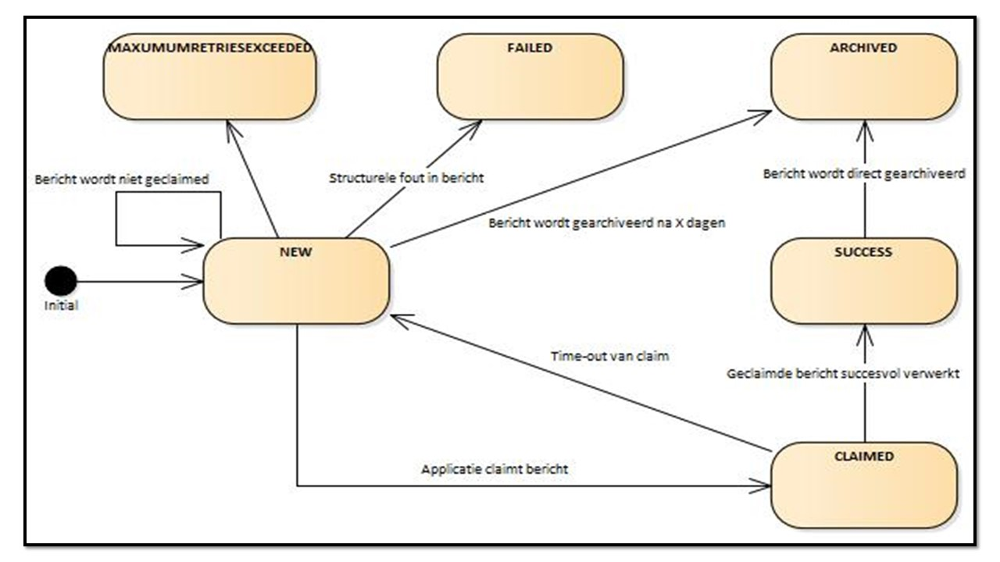
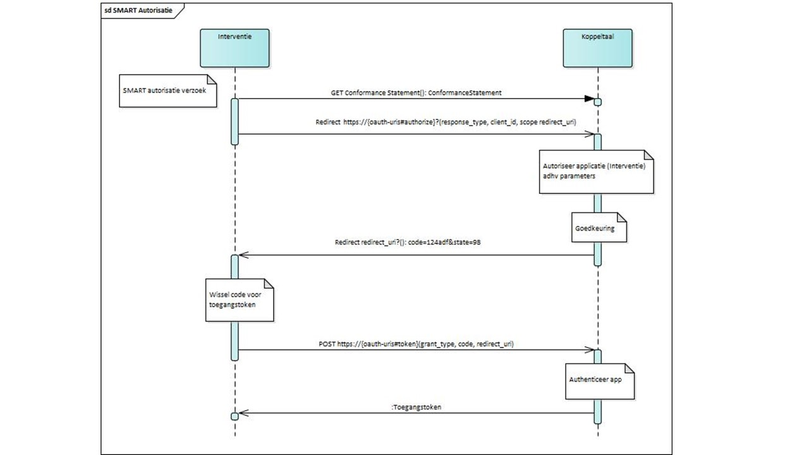
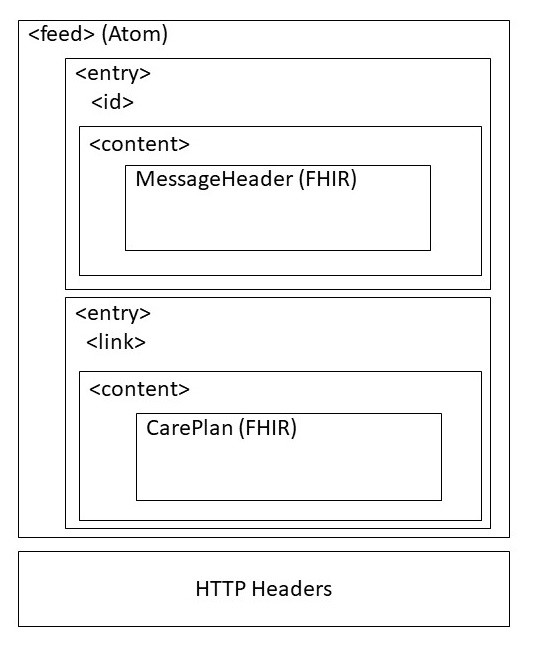
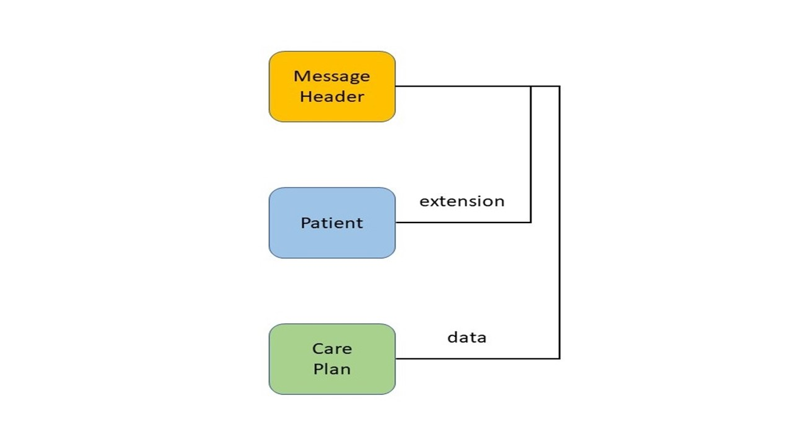

# Technologie architectuur

## Informatie-uitwisseling op basis van FHIR Messaging

### Standaarden

Het transport van berichten volgens Koppeltaal v1.x is gebaseerd op een aantal standaarden: met name _HTTP_, _HL7 FHIR DSTU 1_ \(v0.0.82\) en relevante onderdelen van de HL7 standaard. De content \(inhoud\) kan zowel in _JSON_ als in _XML_ worden uitgedrukt. Koppeltaal gebruikt HTTP als transportmechanisme om FHIR berichten \(resources\) uit te kunnen wisselen en _Atom feed_ om FHIR resources te bundelen. De kern van FHIR wordt gevormd door de _FHIR DSTU1 resources_, waarmee oplossingen voor uitwisseling van zorginhoudelijke gegevens kunnen worden gebouwd. Door middel van profiling \(het maken van specificaties in de vorm van structure definitions en extensions\) en onderlinge verwijzingen is het mogelijk een specifieke set van FHIR resources voor een bepaalde use case, binnen een domein, te definiëren. Elke applicatie type \(eHealth platformen, portalen, interventies of bronsystemen\) gebruikt een eigen set van FHIR resources die via een adapter \(programmeertaal afhankelijke abstractie laag\) met Koppeltaal berichten uitwisselt over het openbare internet.


### Netwerktopologie

De netwerktopologie beschrijft de fysieke verbindingen tussen de netwerkcomponenten onderling. Bij Koppeltaal 1.3 wordt een stertopologie toegepast tussen de verschillende GGZ instellingen en Koppeltaal. Dit is de meest gebruikte topologie voor internet. Alle GGZ instellingen \(domeinen\) worden via internet aangesloten op Koppeltaal. Koppeltaal 1.3 dient hier als technische \(centrale\) dienstverlener, die voor de eindgebruikers verder niet zichtbaar is. Koppeltaal verwerkt geen data, maar routeert data tussen applicaties, binnen één domein. Het vastleggen van toestemming van de gebruiker is geen Koppeltaal aangelegenheid, maar behoort te liggen bij de organisaties die zich aansluiten.

### Het informatiemodel

Het volgende model geeft de verzameling FHIR DSTU1 resources weer die binnen Koppeltaal 1.3 worden gebruikt. De FHIR specificatie definieert een set van datatypes die als FHIR resource elementen gebruikt worden. Het Koppeltaal 1.3 informatiemodel is gebaseerd FHIR Messaging \(berichten\). Bij FHIR Messaging is men gedwongen om een verzameling van resources \(gegevens\) op te halen, ongeacht of men daarvan maar een deel van gebruikt.  


Alle FHIR resources zijn in de basis generiek en worden met behulp van profielen \(profiles\) uitgebreid en specifieker gemaakt voor een specifieke toepassing. In een profiel wordt bijvoorbeeld beschreven:

* Welke resource elementen worden gebruikt en welke niet en welke additionele elementen \(extension\) worden toegevoegd die geen onderdeel zijn van de basisspecificatie
* Welke terminologieën worden gebruikt in bepaalde elementen
* Hoe de resource elementen mappen naar lokale eisen en/of implementaties

Door de manier waarop profiling wordt toegepast binnen FHIR kunnen er voor een bepaalde basis resource verschillende profielen bestaan, bijvoorbeeld afhankelijk van zorgdomein, land, instelling of leverancier. Om interoperabiliteit te borgen is het van belang dat binnen een bepaalde use case dezelfde profielen gebruikt worden.

Voor Koppeltaal 1.3 is een eigen verzameling FHIR resources vastgelegd met hun eigen profile identifiers.

#### Profile Identifiers

| **Resource** | **Profile** **Identifiers** |
| :--- | :--- |
| ActivityDefinition | http://ggz.koppeltaal.nl/fhir/Koppeltaal/Profile/ActivityDefinition |
| Device | http://ggz.koppeltaal.nl/fhir/Koppeltaal/Profile/Application |
| MessageHeader | http://ggz.koppeltaal.nl/fhir/Koppeltaal/Profile/MessageHeader |
| Patient | http://ggz.koppeltaal.nl/fhir/Koppeltaal/Profile/Patient |
| Practitioner | http://ggz.koppeltaal.nl/fhir/Koppeltaal/Profile/Practitioner |
| RelatedPerson | http://ggz.koppeltaal.nl/fhir/Koppeltaal/Profile/RelatedPerson |
| Organization | http://ggz.koppeltaal.nl/fhir/Koppeltaal/Profile/Organization |
| Person | http://ggz.koppeltaal.nl/fhir/Koppeltaal/Profile/Person |
| CarePlan | http://ggz.koppeltaal.nl/fhir/Koppeltaal/Profile/CarePlan |
| CarePlanActivityStatus | http://ggz.koppeltaal.nl/fhir/Koppeltaal/Profile/CarePlanActivityStatus |
| CarePlanActivityResult | http://ggz.koppeltaal.nl/fhir/Koppeltaal/Profile/CarePlanActivityResult |
| UserMessage | http://ggz.koppeltaal.nl/fhir/Koppeltaal/Profile/UserMessage |
| CareTeam | http://ggz.koppeltaal.nl/fhir/Koppeltaal/Profile/CareTeam |

Koppeltaal maakt gebruik van de **Other** resource extensie van FHIR DSTU1.

Other is ingevoerd om te kunnen omgaan met resource concepten die nog niet zijn gedefinieerd voor FHIR of die buiten het interessegebied van HL7 liggen. De volgende tabel geeft aan welke resource geen onderdeel zijn van FHIR DSTU1, maar wel specifiek als resource binnen Koppeltaal gebruikt wordt.

#### Other extensions

| **Other extension** | **Definitie** |
| :--- | :--- |
| ActivityDefinition | Een activiteitsdefinitie beschrijft een activiteit die door een applicatie beschikbaar wordt gemaakt |
| UserMessage | Een bericht dat van een participant naar een participant wordt gestuurd |
| CarePlanActivityStatus | Beschrijft de status van een behandelplan activiteit in detail |
| CarePlanActivityResult | Beschrijft de uitkomsten of berekende scores van een behandelplan activiteit |
| CareTeam | Beschrijft welke personen toegang hebben tot een behandelplan of activiteit |

De **Application** resource is een representatie van een portaal, interventie of een ander soort aangeboden dienst door Koppeltaal. Een applicatie kan een list van activiteiten aanbieden. In de context van Koppeltaal is een Application resource een profiel van een **Device** resource.

Alle berichten worden via HTTP operaties uitgewisseld. Op elke verzoekbericht wordt standaard een HTTP-response code teruggegeven. Bij problemen is er soms meer detail informatie vereist, dan alleen de HTTP-response code. Hiervoor wordt dan de **OperationOutcome** resource gebruikt, waarmee meerdere afzonderlijke problemen kunnen worden geïdentificeerd, die in lijn moeten zijn met de HTTP-response code.

De kern van FHIR Messaging is de **MessageHeader** resource. Via het **event.code**- en **data** element – de berichtgebeurtenis met referentie naar content – worden de verschillende type berichten \(interacties\) gedefinieerd. De MessageHeader resource is voor Koppeltaal \(profiel\) uitgebreid met het Patient element, dat een verwijzing is naar een Patient resource die aangeeft bij welk dossier dit bericht behoort. Het MessageHeader.Patient element is echter geen onderdeel van de \(core\) FHIR MessageHeader.

#### Interacties

De volgende event.codes \(**interacties**\) zijn gedefinieerd om de functionaliteit van Koppeltaal af te dekken, met de daarbij behorende focal FHIR resource die de content van het verzoek bevat, zie het data element.

<table>
  <thead>
    <tr>
      <th style="text-align:left"><b>event.code (interactie)</b>
      </th>
      <th style="text-align:left"><b>Definitie</b>
      </th>
      <th style="text-align:left">
        <p><b>Focal FHIR resource =</b>
        </p>
        <p><b>data referentie</b>
        </p>
      </th>
    </tr>
  </thead>
  <tbody>
    <tr>
      <td style="text-align:left">CreateOrUpdatePatient</td>
      <td style="text-align:left">Patient aanmaken of aanpassen tussen applicaties in &#xE9;&#xE9;n domein</td>
      <td
      style="text-align:left"><b>Patient</b>
        </td>
    </tr>
    <tr>
      <td style="text-align:left">CreateOrUpdatePractitioner</td>
      <td style="text-align:left">Behandelaars aanmaken of aanpassen tussen applicaties in &#xE9;&#xE9;n
        domein</td>
      <td style="text-align:left"><b>Practitioner</b>
      </td>
    </tr>
    <tr>
      <td style="text-align:left">CreateOrUpdateRelatedPerson</td>
      <td style="text-align:left">Derden (familie gerelateerden) aanmaken of aanpassen tussen applicaties
        in &#xE9;&#xE9;n domein</td>
      <td style="text-align:left"><b>RelatedPerson</b>
      </td>
    </tr>
    <tr>
      <td style="text-align:left">CreateOrUpdateActivityDefinition</td>
      <td style="text-align:left">(Sub)activiteiten publiceren voor gebruik in andere applicaties in het
        domein</td>
      <td style="text-align:left"><b>ActivityDefinition</b> (Other)</td>
    </tr>
    <tr>
      <td style="text-align:left">CreateOrUpdateCarePlan</td>
      <td style="text-align:left">(Sub)activiteiten uit applicaties toekennen aan een gebruiker (Patient,
        RelatedPerson) in een andere applicatie dan waar de (Sub)activiteiten zijn
        opgeslagen</td>
      <td style="text-align:left"><b>CarePlan</b>
      </td>
    </tr>
    <tr>
      <td style="text-align:left">UpdateCarePlanActivityStatus</td>
      <td style="text-align:left">Voortgang- en statusberichten van (sub)activiteiten delen en ontvangen</td>
      <td
      style="text-align:left"><b>CarePlanActivityStatus</b> (Other)</td>
    </tr>
    <tr>
      <td style="text-align:left">CreateOrUpdateCarePlanActivityResult</td>
      <td style="text-align:left">Resultaatberichten van (sub)activiteiten delen en ontvangen</td>
      <td style="text-align:left"><b>CarePlanActivityResult</b> (Other)</td>
    </tr>
    <tr>
      <td style="text-align:left">CreateOrUpdateUserMessage</td>
      <td style="text-align:left">Algemene gebruikersberichten delen en ontvangen</td>
      <td style="text-align:left"><b>UserMessage</b> (Other)</td>
    </tr>
  </tbody>
</table>

In de paragraaf "[FHIR Resources](technologie-architectuur.md#fhir-resources)" is de structuur in detail verder uitgewerkt van alle Koppeltaal resources met alle elementen en attributen.

### Uitgangspunten bij informatie-uitwisseling

#### Informatie uitwisseling gebeurt via FHIR Messaging en operationele uitkomsten.

In FHIR messaging of FHIR-berichten, wordt een bericht verstuurd van een bronapplicatie naar één of meerdere bestemmingen, wanneer er een gebeurtenis plaatsvindt. Het bericht bestaat uit een bundel die wordt geïdentificeerd door het type bericht, waarbij de eerste \(FHIR\) resource in de bundel een **MessageHeader** resource is. De MessageHeader heeft een **identifier -** en een **event.code** element – de berichtgebeurtenis – die de aard van het bericht uniek identificeert, en het bevat aanvullende verzoek metagegevens. De andere aanvullende \(FHIR\) resources in de bundel zijn afhankelijk van het type aanvraag. Het **data** element heeft een referentie naar de onderliggende resource \(de focal resource\), waar dit berichttype toe behoort.

```markup
<MessageHeader xmlns="http://hl7.org/fhir">
   …
   <identifier value="3f03e865-e87c-4337-922c-5be69dbcd243"/>
   <timestamp value="2019-05-17T08:01:10+00:00"/>
   <event>
      <system value="http://ggz.koppeltaal.nl/fhir/Koppeltaal/MessageEvents"/>
      <code value="CreateOrUpdateCarePlan"/>
      <display value="CreateOrUpdateCarePlan"/>
   </event>
   <data>
      <reference value="http://vzvz.nl/fhir/Koppeltaal/CarePlan/280ff751d626"/>
   </data>
</MessageHeader>
```

MessageHeader van CreateOrUpdateCarePlan

Operationele uitkomsten zijn een verzameling van fout-, waarschuwings- en informatieberichten die gedetailleerde informatie geven over het resultaat van een bepaalde gebeurtenis. Het bericht, een **OperationOutcome** resource, wordt geleverd als een directe systeem response, of als onderdeel daarvan, waar ze informatie geven over het resultaat van een bepaalde gebeurtenis.

#### Berichten zijn self-contained

Elk bericht dat tussen applicaties wordt uitgewisseld moet op zichzelf staan \(self-contained\), er wordt niet verwezen naar externe bronnen. De reden van dit uitgangspunt is dat nieuwe aangesloten applicaties altijd up-to-date zijn met de gegevensuitwisseling en dat er geen kopieën van gegevens opgeslagen worden. Alle gegevens waarvan de verzendende applicatie eigenaar van is, moeten in de berichtenbundel opgenomen worden.

Gegevens waarvan de verzendende applicatie geen eigenaar van is, krijgen een verwijzing in de bundel mee via een URL. Een voorbeeld hiervan is van een geselecteerde ActivityDefinition met een identifier in een CreateOrUpdateCarePlan-bericht.

```markup
<CarePlan xmlns="http://hl7.org/fhir">
   …
   <activity id="280ff751d626">
      <extension url="http://vzvz.nl/fhir/Koppeltaal/CarePlan#ActivityDefinition">
         <valueString value="a73997e2-173a-4e89-b3c2-653b7540c610"/>
      </extension>
   </activity>
</CarePlan>
```

Referentie vanuit CarePlan naar ActivityDefinition

#### FHIR resources zijn uniek identificeerbaar

Alle berichten en de daarin voorkomende resource moeten uniek binnen een domein identificeerbaar zijn. Hiervoor wordt het "**id**" element of attribuut gebruikt. Het "id" wordt door een lokale \(interne\) dienst uitgegeven en gebruikt tussen applicaties binnen een domein. Als gegevens worden gekopieerd, wijzigt het "id", omdat het "id" als interne sleutel wordt gebruikt om gegevens, zoals berichten, uniek te kunnen identificeren bij één dienst.

In de context van de gezondheidszorg worden de \(FHIR\) resources geïdentificeerd aan de hand van veelgebruikte type identficaties voor personen, organisaties, definities, etc. Deze \(FHIR\) resources worden in bronsystemen vastgelegd, waarin overdraagbare identificaties zijn toegewezen om zo de resources buiten de context van Koppeltaal te kunnen identificeren, te gebruiken en te volgen. Hiervoor wordt het element "**identifier**" gebruikt.

```markup
<Other id="6720" xmlns="http://hl7.org/fhir">
   <identifier>
      <use value="official"/>
      <system value="http://vzvz.nl/fhir/Koppeltaal/Profile/ActivityDefinition#ActivityDefinitionIdentifier"/>
      <value value="a73997e2-173a-4e89-b3c2-653b7540c610"/>
   </identifier>
   <code>
      <coding>
         <system value="http://vzvz.nl/fhir/Koppeltaal/OtherResourceUsage"/>
         <code value="ActivityDefinition"/>
         <display value="ActivityDefinition"/>
      </coding>
    </code>
 </Other>
```

id versus identifier

De volgende tabel toont welke type "identifiers" er gebruikt worden in de verschillende Koppeltaal berichten.

<table>
  <thead>
    <tr>
      <th style="text-align:left"><b>Resource</b>
      </th>
      <th style="text-align:left"><b>Resource Identificatie (Uri)</b>
      </th>
    </tr>
  </thead>
  <tbody>
    <tr>
      <td style="text-align:left">Organization</td>
      <td style="text-align:left">Hier zijn unieke identificaties voor, zie ook het Zorg Adres Boek</td>
    </tr>
    <tr>
      <td style="text-align:left">Patient</td>
      <td style="text-align:left">Bsn</td>
    </tr>
    <tr>
      <td style="text-align:left">Practitioner</td>
      <td style="text-align:left">agb-z of uzi-nr-pers</td>
    </tr>
    <tr>
      <td style="text-align:left">RelatedPerson</td>
      <td style="text-align:left">Bsn</td>
    </tr>
    <tr>
      <td style="text-align:left">ActivityDefinition</td>
      <td style="text-align:left">
        <p>http://ggz.koppeltaal.nl/fhir/Koppeltaal/Profile/ActivityDefinition#</p>
        <p>ActivityDefinitionIdentifier</p>
      </td>
    </tr>
    <tr>
      <td style="text-align:left">Application (Device)</td>
      <td style="text-align:left">Unieke Zorgverlener Identificatienummer defini&#xEB;ren van uzi-nr-sys</td>
    </tr>
  </tbody>
</table>

#### Berichten worden via een standaard HTTP operaties uitgewisseld

Operaties zijn bewerkingen die op FHIR resources uitgevoerd kunnen worden. Hierdoor kunnen applicaties met elkaar communiceren. FHIR suggereert het gebruik van standaard HTTP-werkwoorden \(GET, POST, PUT en DELETE\) als operaties. Dit resulteert in een generieke, voor zichzelf sprekende interface op basis van welke applicaties interactie hebben met andere applicaties \(via Koppeltaal\).

#### URL opbouw

Voor internet is er een uniek concept voor id’s: de URL of Uniform Resource Locator. De URL geeft de unieke locatie van een bron aan.

Aan elke resource \(gegevensbron\) wordt een unieke FHIR-basis URL toegewezen, welke de basis vormt als referentie naar de resource. Elke resource dat in een FHIR message \(bericht\) wordt gestopt, moet een unieke URL hebben die er als volgt uitziet:

> _scheme://FHIR Basis URL + "/" + **Resource Type** + "/" + id \[ + "/\_history/" + Versie Id\]_
>
> **GET** https://vzvz.nl/fhir/Koppeltaal/**Other**/ActivityDefinition:6720/\_history/2019-11-14T14:34:26:611.7847
>
> Als de resource nog niet aangemaakt is, is er nog geen historie. Voorbeeld:
>
> **POST** https://vzvz.nl/fhir/Koppeltaal/**Other**/ActivityDefinition:6720

URL opbouw.

URL’s moeten voldoen aan RFC3986 sectie 6 appendix A.

#### Berichten hebben meerdere representaties

Een representatie van een bericht is een indeling waarin de gegevens \(FHIR resources\) worden getransporteerd tussen applicaties. Door gebruik te maken van HTTP content negotiatie \(onderhandeling over inhoud\) kan een aanvrager \(client\) vragen om een representatie in een bepaald formaat. FHIR staat meerdere representaties toe. De aanvragers \(clients\) kunnen worden opgebouwd rond XML en JSON.

```markup
<Patient xmlns="http://hl7.org/fhir">
   <name>
      <use value="official" />
      <text value="Berend Botje" />
      <family value="Botje" />
      <given value="Berend" />
   </name>
   <telecom>
      <system value="phone" />
      <value value="+61481059995" />
      <use value="mobile" />
   </telecom>
   <gender value="male" />
   <birthDate value="1902-12-05" />
</Patient>
```

XML- content

```javascript
{
    "resourceType": "Patient",
    "name": [{
        "use": "official",
        "text": "Berend Botje",
        "familiy": "Botje",
        "given": ["Berend"]
    }],
    "telecom": [{
        "system": "phone",
        "value": "+61481059995",
        "use": "mobile"
    }],
    "gender": "male",
    "birthDate": "1902-12-05"
}
```

JSON- content

#### Resource content hebben een versie id

Bij het aanmaken of wijzigen van resources, houdt de Koppeltaal server de resource content en versie id van de resource bij, en deelt bij nieuwe of bij wijzigingen van de resource content, een nieuwe versie id uit, dat een datetimestamp in UTC is. De aanvrager \(client\) mag de versie id nooit wijzigen.

Om wijzigingen op gegevens gecontroleerd uit te voeren, wordt er gebruik gemaakt van "Optimistic Locking" omdat het HTTP protocol "stateless" is. De Koppeltaal server onthoudt geen locks.

Bij het wijzigen van de resource content moet de aanvrager \(client\) de meest recente versie id van de resource meesturen. Indien de versie id van de aanvrager niet match met de versie id van wat de Koppeltaal server als laatst heeft uitgegeven, wordt het wijzigingsverzoek van de aanvrager niet geaccepteerd en krijgt de aanvrager een HTTP status code "409: Conflict" antwoord terug, met gedetailleerde informatie in een "OperationOutcome" resource over welke resource\(s\) de verkeerde versie id gebruiken.

```markup
<OperationOutcome xmlns="http://hl7.org/fhir">
   <text>
      …
   </text>
   <issue>
      <severity value="error" />
      <type>
         <system value="http://hl7.org/fhir/issue-type" />
         <code value="conflict" />
      </type>
      <extension url="http://ggz.koppeltaal.nl/fhir/Koppeltaal/OperationOutcome#IssueResource">
         <valueResource>
            <reference value="http://demo.koppeltaal.nl/fhir/Patient/382" />
         </valueResource>
      </extension>
      <details value="The specified resource version is not correct." />
   </issue>
</OperationOutcome>
```

Versie id foutmelding met Patient 382.

In antwoord op aanvragen wordt in het **MessageHeader.data** element gerefereerd naar de focal resource van het bericht, oftewel de root van het bericht. Deze referentie is alleen bij een wijziging op een bestaande resource geversioneerd.

```markup
<MessageHeader xmlns="http://hl7.org/fhir">
   …
   <data>
      <reference value="https://vzvz.nl/fhir/Koppeltaal/CarePlan/1234/_history/2018-04-03T11:41:26:178.1210" />
   </data>
</MessageHeader>
```

Referentie naar geversioneerde CarePlan 1234

#### De 'Conformance Statement'

Conformance is het voldoen aan \(interne\) kwaliteitsdoelstellingen en het invullen en naleven van intern beleid, mede door gebruik van externe standaarden \(zoals OAuth2\). Een 'Conformance Statement' \(conformiteitsverklaring\) is een belangrijk onderdeel van FHIR. Het wordt gebruikt als een verklaring van kenmerken van de daadwerkelijke serverfunctionaliteit of van een verzameling regels waaraan een toepassing moet voldoen.

Bij informatie uitwisseling via FHIR Messaging hebben we ook te maken met \(eenmalige\) authenticatie van de participanten door gebruik te maken van Single Sign-On \(SSO\) bij het lanceren van interventies \(eHealth modules\). Hierbij moeten participanten zich eenmalig authentiseren, waarna ze automatisch toegang krijgen tot meerdere applicaties en resources in een domein van Koppeltaal. Met behulp van het 'Conformance Statement' kunnen aangesloten applicaties informatie over de OAuth2 implementatie bij Koppeltaal voor Single-Sign-On achterhalen.

Het opvragen van het 'Conformance Statement' met betrekking to OAuth2 URL’s bij Koppeltaal wordt verkregen via de GET operatie naar een vast endpoint \(URL\), bijvoorbeeld GET https://base.koppeltaal.nl/fhir/Koppeltaal\*\*/metadata\*\*. Hiermee krijgt de aanvrager informatie over de OAuth2 implementatie voor Single-Sign-On. De 'Conformance Statement' resource is hiervoor uitgebreid met launch \(opstart\) URL’s.

```javascript
{
  "resourceType": "Conformance",
  …
  "rest": {
    …
    "security": {
      "extension": [
        {
          "url": "http://fhir-registry.smartplatforms.org/Profile/oauth-uris#authorize",
          "valueUri": "https://vzvz.koppeltaal.nl/Outh2/Authorize"
        },
        {
          "url": "http://fhir-registry.smartplatforms.org/Profile/oauth-uris#token",
          "valueUri": "https://vzvz.koppeltaal.nl/Outh2/Token"
        }
      ],
     …
    }
  }
}
```

Conformance Statement

Volgende tabel geeft een overzicht van de nieuwe URL’s die door Koppeltaal wordt gebruik voor OAuth2.

| URI extensie | Omschrijving |
| :--- | :--- |
| http://fhir.vitalhealthsoftware.com/Profile/Conformance\#Launch | Identificeert de OAuth2 "launch" URL voor de server |
| http://fhir-registry.smarthealthit.org/Profile/oauth-uris\#authorize | Identificeert de OAuth2 "autorisatie" URL voor de server |
| http://fhir-registry.smarthealthit.org/Profile/oauth-uris\#token | Identificeert de OAuth2 "token" URL voor de server |

Daarnaast definieert Koppeltaal 4 extensies die de validatie van verzoeken \(request\) en antwoorden \(reply\) regelen:

| **URI extensieURI extensie** | **Type** | **Omschrijving** |
| :--- | :---: | :--- |
| http://fhir.vitalhealthsoftware.com/Profile/Conformance\#ValidateRequestsAgainstSchema | Boolean | Bij 'true', valideert de server het verzoek \(request\) tegen een XML Schema |
| http://fhir.vitalhealthsoftware.com/Profile/Conformance\#ValidateRepliesAgainstSchema | Boolean | Bij 'true' valideert de server het antwoord \(reply\) tegen een XML Schema |
| http://fhir.vitalhealthsoftware.com/Profile/Conformance\#ValidateRequestsAgainstProfile | Boolean | Bij 'true', valideert de server het verzoek \(request\) tegen een FHIR profiel |
| http://fhir.vitalhealthsoftware.com/Profile/Conformance\#ValidateRepliesAgainstProfile | Boolean | Bij 'true' valideert de server het antwoord \(reply\) tegen een FHIR profiel |

Algemene informatie over de 'Conformance Statement' kan men vinden bij [https://www.hl7.org/fhir/DSTU1/conformance.html](https://www.hl7.org/fhir/DSTU1/conformance.html).

## Het applicatie model

Koppeltaal ondersteunt alleen de voor gedefinieerde interacties en binnen deze sectie wordt gekeken naar deze interacties tussen de verschillende type applicaties binnen een domein.


Er zijn verschillende typen applicaties betrokken ter ondersteuning van een interactief zorgproces. Functioneel zijn alle applicaties onderdeel van de gehele Koppeltaal omgeving en ondersteunen het interactieproces vanuit verschillende rollen voor de gebruikers. Per domein sluit een applicatie aan met een unieke _applicatie-instantie_, waarin die rollen binnen dat domein zijn gedefinieerd.

We onderscheiden de volgende \(technische\) rollen binnen Koppeltaal:

* Voor de verschillende type Portalen \(toegangspoort voor participanten\) onderscheiden we de **Patient**, **Practitioner** en **RelatedPerson**
* Voor de verschillende type interventies onderscheiden we de **Game**, **E-Learning** en **ROM**

Applicaties kunnen in andere applicaties geïntegreerd zijn, als onderdeel van een behandelplan.

Indien de applicatie als rol een Interventie type representeert kan deze verschillende 'ActivityDefinitions' publiceren bij Koppeltaal. Deze 'ActivityDefinitions' kunnen vervolgens via Koppeltaal in een Portaal aan een participant getoond worden.

Applicaties met een unieke _applicatie-instantie_, waarin die rollen binnen dat domein zijn gedefinieerd, mogen alleen binnen dat domein met elkaar communiceren.

Koppeltaal ondersteunt de volgende processen voor de uitwisseling van berichten:

1. Bericht versturen
2. Bericht routeren
3. Bericht notificatie
4. Bericht ophalen

### Bericht versturen

Alle applicaties maken gebruik van de standaard HTTP operatie POST om berichten \(FHIR Message DSTU1\) te versturen. De berichten worden naar een vaste endpoint \(URL\) van Koppeltaal gestuurd, zie 'interactie ontvangen' \(technische service\) waarvan de basis URL bijvoorbeeld https://koppeltaal.nl/FHIR/Koppeltaal/Mailbox is. Elk binnenkomend bericht wordt \(tijdelijk\) gepersisteerd in een datastore. De structuur van het bericht is, in hoofdstuk  "[Informatie-uitwisseling op basis van FHIR Messaging](technologie-architectuur.md#fhir-messaging)", beschreven.

De opslag van de Message Header \(metadata van het bericht\) en de content van het bericht \(Message Body\) zullen apart gepersisteerd worden in verschillende tabellen.

Elk bericht dat gestuurd wordt door een applicaties, heeft een versie id als het om een wijziging gaat van gegevens \(focal resources\). Als er meerdere applicaties hetzelfde type bericht verstuurd met betrekking tot dezelfde gegevens, zal elk van hun een subscriptie \(abonnement\) voor dit bericht **moeten** hebben, om de versie id van zijn eigen interne resource ‘up-to-date’ te houden met dat van anderen. Elk bericht dat door een applicatie verstuurd wordt, moet de laatste versie id gebruiken, dat door Koppeltaal wordt uitgegeven. Koppeltaal zal van elk binnenkomend bericht de versie id controleren met wat Koppeltaal zelf heeft uitgegeven, en het bericht pas accepteren als de versie id’s van de focal resources gelijk zijn.

In Koppeltaal worden de subscripties \(abonnementen\) per type bericht, per geregistreerde applicatie binnen een domein aangemaakt en beheerd.

### Bericht routeren

Het routeren van binnenkomende berichten gebeurt binnen een domein en de berichten worden aan die applicaties opgeleverd waar een subscriptie \(gekoppeld abonnement\) in Koppeltaal voor is. De subscripties zijn deel van de unieke _applicatie-instantie_ configuratie en zijn gespecificeerd per type bericht die door Koppeltaal worden ondersteund, zie "[Interacties](informatiesystemen-architectuur.md#interacties)".

### Bericht notificatie

Koppeltaal biedt een functie aan om notificaties te versturen als er een nieuw bericht beschikbaar is voor een applicatie. Deze notificatie is geïmplementeerd middels REST WebHooks. Om een notificatie te kunnen ontvangen zijn de volgende configuratie acties nodig:

* Een WebHook URL definiëren, tijdens de registratie en configuratie van een applicatie in het domein, die Koppeltaal kan aanroepen.
* De lokale implementatie achter de WebHook URL is nodig om notificaties te kunnen interpreteren. Koppeltaal zal een event genereren, ter informatie dat er ‘nieuwe’ berichten beschikbaar zijn. De betreffende applicatie wordt maximaal 5 keer gesignaleerd. De applicatie kan daarna het bericht lezen zoals al beschreven in paragraaf [Bericht ophalen](informatiesystemen-architectuur.md#bericht-ophalen). 
* In de notificatie wordt een correlatie id \(MessageHeader.identifier\) meegestuurd van het bericht dat beschikbaar is voor de applicatie. 

### Bericht ophalen

Alle applicaties maken gebruik van de standaard HTTP operatie GET om berichten \(FHIR Message DSTU1\) op te halen. De berichten kunnen van een vaste endpoint \(URL\) bij Koppeltaal opgehaald worden, zie 'interactie ophalen' \(technische service\) waarvan de basis URL bijvoorbeeld https://koppeltaal.nl/FHIR/Koppeltaal/MessageHeader is.

Indien een applicatie niet gebruik maakt van notificaties en de REST WebHooks niet geïmplementeerd heeft, kan de applicatie de Koppeltaal server met een vaste interval bevragen \(actief polling\). De frequentie waarmee deze opvragen plaatsvindt, heet de poll frequentie.

Aan de hand van de basis URL en MessageHeader.id kan men één geïdentificeerd bericht ophalen. Met behulp van de basis URL, `_search` operatie en `_query` parameters kan men een bundel MessageHeaders opvragen en hiermee vervolgens de bundel doorzoeken naar de juiste MessageHeader.id met onderliggende content.

De volgende `_search` operatie en `_query` parameters worden door Koppeltaal 1.3 ondersteund.

1. `GET https://koppeltaal.nl/FHIR/Koppeltaal/MessageHeader/_search?_query=MessageHeader.GetNextNewAndClaim` - zoeken naar een volgend bericht met ProcessingStatus= "New", maak ProcessingStatus "Claimed", en stuur dat specifieke bericht terug. Deze call zal altijd het gevolg moeten zijn van een update van de Message status. Deze interactie heeft tot gevolg dat de berichtstatus wordt aangepast.
2. `GET https://koppeltaal.nl/FHIR/Koppeltaal/MessageHeader/_search?_count=[X\]` - deze stuurt een Bundle van MessageHeaders terug om de applicaties te laten zoeken naar een of meerdere specifieke berichten. Een pagesize kan doorgegeven worden met de \_count parameter, met een max van 1000.
3. `GET https://koppeltaal.nl/FHIR/Koppeltaal/MessageHeader/_search?_id=[id\]` - deze kan gebruikt worden om een complete Bundle voor een specifiek bericht te krijgen \(bijv. Als de MessageHeader bekend was door de voorgaande zoekactie\)

De volgende additionele \_query parameters kunnen gespecificeerd worden:

* Patient: Filtert op de patiënt dossier waar het bericht aan gerelateerd is.
* Event: Filtert op het bericht type
* ProcessingStatus: Filtert op de ProcessingStatus. \(New\|Claimed\|Success\|Failed\). Deze query parameter kan geen onderdeel zijn van de named query van interactie 1, zoals hierboven beschreven.

Voor het ophalen en verwerken van de MessageHeaders is er een specifiek Koppeltaal element ‘ProcessingStatus’ toegevoegd, die aangeeft wat de stand is van de verwerking van een bericht. Dit element is geen standaard element van de MessageHeader resource.



Het 'ProcessingStatus' element heeft één van de 6 mogelijke verwerkingstoestanden. Namelijk:

* NEW. Dit bericht is nog niet opgehaald en gelezen door de betreffende applicatie
* CLAIMED. Dit bericht is door een applicatie geclaimd. Dit is een tijdelijke toestand, want als het bericht volledig gelezen is dan is er SUCCES geboekt. Een CLAIM kan ook vervallen, bij een time-out wordt de toestand van het bericht weer op NEW gezet.
* SUCCESS. Het bericht is succesvol opgehaald en gelezen door de betreffende applicaties.
* ARCHIVED. Ongelezen nieuwe berichten of berichten die succesvol waren gelezen, waarvan bewaartermijn van verlopen is.
* FAILED. Berichten die een structurele fout hebben.
* MAXIMUMRETRIESEXCEEDED. Na maximum \(van 5\) keer geprobeerd te hebben om het bericht op te halen.

## Het SMART App launch raamwerk

Naast het kunnen uitwisselen van gegevens ondersteunt Koppeltaal ook het koppelen van applicaties van derden met deze gegevens, waardoor apps kunnen worden gestart binnen de gebruikersinterface of context van Koppeltaal. SMART staat voor "Substitutable Medical Applications and Resuable Technologies". Dit raamwerk ondersteunt apps voor gebruik van behandelaren, patiënten en anderen via een Portal of een FHIR systeem waar een gebruiker toestemming kan geven om een app te starten. Het raamwerk biedt een betrouwbaar, veilig autorisatie protocol voor verschillende app-architecturen, waaronder apps die op een beveiligd platform draaien en op het apparaat van een eindgebruiker draaien.

Het SMART App launch raamwerk definieert een methode waarmee een app \(eenmalig\) toestemming vraagt ​​om toegang te krijgen tot een FHIR-resource en die autorisatie \(toegangstoken\) vervolgens gebruikt om de resource op te halen. Het SMART App launch raamwerk bij Koppeltaal is gebaseerd op de OAuth2 standaard \(RFC6749 en RFC6750\) en geïmplementeerd volgens de SMART-on-FHIR voorschriften \(zie [http://www.hl7.org/fhir/smart-app-launch/](http://www.hl7.org/fhir/smart-app-launch/)1.0.0\).

Volgens de OAuth2 specificaties kunnen er twee typen Clients worden onderscheiden:

* "Public Client" Een Public Client draait volledig op een eindgebruiker apparaat. Gevolg is dat de applicatie geen "cliënt secret" kan beschermen in het geval dat er ook geen applicatie logica op een server zou draaien. Voorbeelden JavaScript app in een browser. The Ranj Kick-ASS game is een voorbeeld van een Public Client applicatie.
* "Confidential Client" Is een applicatie die een "cliënt secret" kan beschermen door gebruik te maken van “server-side business logic”. Het grote verschil tussen Publieke en Confidentiële Clients is als de Client de toegang tot het Token endpoint gebruikt, de confidentiële Client de client\_id en client\_secret als basis authenticatie header kan aanleveren.

Toegangstokens worden aangevraagd bij een OAuth2-compatibele autorisatieserver \(Koppeltaal server\) via een TLS beveiligde kanaal \(zie hoofdstuk "[Beveiliging](technologie-architectuur.md#beveiliging)"\).

Configuratie gegevens, zoals codes en toegangstokens, kan men via de Conformance Statement \(zie paragraaf De '[Conformance Statement](informatiesystemen-architectuur.md#de-conformance-statement)' \) opvragen.

De mate waarin informatie en gegevens \(resources\) beschermt moet worden zodat \(eind\)gebruikers, en andere producten de juiste mate van gegevenstoegang hebben passend bij hun soort en niveau van autorisatie.

Elke applicatie is verantwoordelijk voor het beschermen van zichzelf tegen mogelijke wangedrag of kwaadaardige waarden voor het verkrijgen van ongeoorloofde toegang en gebruik. Elke applicatie moet daarvoor de nodige tegenmaatregelen nemen om zichzelf en alle gevoelige informatie die deze bevat, te beschermen. Zie hiervoor de "OAuth 2.0 Threat Model and Security Considerations" \(RFC6819\).

Naast het borgen van kwaliteitscriteria vereist de norm NEN 7510 dat informatiebeveiligingsmaatregelen op controleerbare wijze zijn ingericht voordat kan worden gesproken over adequate informatiebeveiliging.

### Authenticatie

Authenticatie wordt bij Koppeltaal op _applicatie-instantie_ niveau afgehandeld. Dat wil zeggen dat een \(applicatie\) account wordt aangemaakt voor een applicatie-instantie en deze wordt vervolgens aan een domein gekoppeld. Een applicatie account heeft een unieke gebruikersnaam en wachtwoord.

De gebruikersnaam en wachtwoord, die toegekend zijn aan een applicatie-instantie, worden in de koptekst \(header\) van HTTP op de volgende manier geplaatst: 'Authorization : Basic &lt;credentials&gt;', waarbij de credentials een Base64 codering is van gebruikersnaam en wachtwoord, verbonden met een dubbele punt ':'. Dit wordt in RFC7617 2015 gespecificeerd.

Er kan ook gebruik gemaakt worden van een OAuth2 bearer token voor authenticatie, die door een applicatie-instantie verkregen wordt, via een handshake protocol met Koppeltaal. De applicatie-instantie plaatst het token op de volgende manier in de koptekst \(header\) van HTTP: 'Authorization : Bearer &lt;token&gt;'. Het token is een Base64 codering.

Alle interacties worden onder een applicatie account uitgevoerd \(en bevinden zich daardoor binnen een domein\).

Na succesvolle authenticatie wordt geverifieerd dat het domein dat in het bericht is opgegeven, hetzelfde domein is als waaraan de geverifieerde gebruiker is toegewezen.

### De Single-Sign-On \(SSO\) flow

Bij Koppeltaal maken we gebruik van Single-Sign-On \(SSO\). Hiermee kunnen eindgebruikers zich eenmalig authentiseren \(inlog procedure\), waarna automatisch toegang wordt verschaft tot meerdere type applicaties en resources in het Koppeltaal domein. 

Koppeltaal ondersteunt twee typen van Single-Sign-On flows, met Koppeltaal Server als OAuth2-compatibele autorisatieserver en de Applicatie als OAuth2 Client:

* [SMART Autorisatie voor webapplicaties](technologie-architectuur.md#smart-autorisatie-voor-webapplicaties), voor het autoriseren en starten van webapplicaties \(zoals een eHealth-module, of een ROM lijst\).
* [SMART Autorisatie voor mobiele apps](technologie-architectuur.md#smart-autorisatie-voor-mobiele-apps), voor het starten van een app op een smartphone van een eindgebruiker.

Koppeltaal biedt na het authenticatie proces en na selectie van activiteiten via het Portal de gebruiker een URL link aan naar een applicatie \(interventie\), waarmee de gebruiker de applicatie kan starten. De gebruiker heeft hiermee zowel het Portal als een \(web of mobiele\) applicatie tot zijn beschikking.

Wanneer de gebruiker de applicatie URL opent, moeten de volgende gegevens aan Koppeltaal doorgegeven worden:

1. Application Identifier \(gekoppeld aan een specifieke applicatie\) – noodzakelijk om de Koppeltaalserver de publicerende applicatie en zijn URL op te kunnen zoeken.
2. Patient identifier – wordt gebruikt om de patiënt te identificeren door de applicatie \(Game\).
3. User identifier – wordt gebruikt door de applicatie om correcte views te laten zien voor die gebruiker
4. Een overeengekomen security token van de applicatie naar de Koppeltaal Server wordt verstuurd, zodat de Koppeltaal server kan verifiëren dat de aanroepende applicatie een bekende \(en geregistreerde\) applicatie is die kan worden vertrouwd in de context van domein en applicatie-instantie. Dit token bevat tenminste een Hash van de URL van de applicatie en voorkomt dat iemand de URL van de applicatie \(het adres\) aanpast en opnieuw indient bij de Koppeltaal Server. Tevens bevat het token een \(geheime\) code die zowel bij de applicatie als de Koppeltaal server bekend is en, mogelijk, een Nonce die voorkomt dat de URL meerder malen \(sessies, resource\) misbruikt kan worden.

Naast de bovengenoemde velden, kunnen er ook _optionele velden_ gebruikt worden die doorgegeven worden:

1. CarePlanActivity identifier – gebruikt om te achterhalen welke activiteiten een bepaalde applicatie \(Game\) herkent.
2. Aanvullende applicatie informatie - bijvoorbeeld dat er een specifieke pagina door de applicatie moet worden geopend.

### SMART Autorisatie voor webapplicaties



Met behulp van de 'Conformance Statement' \(zie paragraaf De '[Conformance Statement](informatiesystemen-architectuur.md#de-conformance-statement)'\) kan een \(gelanceerde\) applicatie een OAuth2 autorisatie verzoek indienen bij Koppeltaal \(zie ook RFC 6749\). De applicatie gebruikt hierbij de authorize- en token endpoints uit de 'Conformance Statement'. De applicatie moet de scoop van het autorisatie verzoek specificeren, dit is onderdeel van het OAuth2 protocol, dat voor Koppeltaal v1.3 "patient/\*.\*" is. Dit betekent dat de applicatie toegang vraagt tot alle berichten van de patiënt waarop deze applicatie is geabonneerd. Verder worden bij het autorisatie verzoek de volgende parameters doorgegeven aan Koppeltaal:

* reponse\_type. Dit wordt ingevuld met de waarde 'code' waarmee de aanvragende applicatie aangeeft dat het een autorisatie code wil ontvangen.
* client\_id. Moet worden ingevuld met de waarde van de toegewezen identifier van de aanroepende applicatie
* scope. Bevat de scopes "patient/\*,read" en "launch:applicatie-instantie", om de verbinding te leggen tussen de vragende context en lanceer aanvraag
* redirect\_uri. Is de URL waarheen de aanvragende applicatie wordt gerouteerd, na een succesvolle autorisatie bij Koppeltaal
* state. Een optionele toestandswaarde dat de gelanceerde applicatie kan gebruiken voor het kunnen traceren van de aanvraag

```bash
https://vzvz.koppeltaal.nl/Outh2/Authorize?
   response_type=code&
   client_id=RANJKA&
   scope=Patient%2F*.read%20launch%3A593740&
   redirect_uri=https%3A%2F%2Fapp%2Fafter-auth&
   state=98wrghuwuogerg97
```

SMART autorisatie verzoek

Voor het autorisatie verzoek zal Koppeltaal een authorization\_code via de redirect\_uri teruggeven als de autorisatie aanvrager toegang krijgt. Indien het verzoek wordt afgewezen, krijgt de autorisatie aanvrager een foutmelding. Verder wordt de state van het autorisatie verzoek meegestuurd in het antwoord.

```bash
https://app/after-auth?
   code=124adf&
   state=98wrghuwuogerg97
```

Antwoord op autorisatie verzoek

Autorisatiecodes zijn van korte duur en verlopen meestal binnen een minuut.

De laatste stap die de app vervolgens moet uitvoeren, is de autorisatie code omwisselen voor een toegangstoken \(Zie ook RFC6749 sectie 4.1.3\). Hiervoor gebruikt de applicatie het token endpoint uit de ‘Conformance Statement’. De volgende parameters worden aan Koppeltaal doorgegeven voor de uitwisseling:

* grant\_type. Vaste waarde : "authorization\_code"
* code. De code die bij het autorisatie verzoek is ontvangen
* redirect\_uri. Is de URL waarheen de aanvragende applicatie wordt gerouteerd, na een succesvolle uitwisseling bij Koppeltaal
* client\_id. Moet worden ingevuld met de waarde van de toegewezen identifier van de aanroepende applicatie

Koppeltaal geeft de volgende informatie terug bij uitwisseling.

* access\_token. Het toegangstoken dat de applicatie gebruikt voor het opvragen van gegevens \(het formaat van het token is in RFC6749 en RFC7650 beschreven\)
* toke\_type. Is een vaste waarde "Bearer"
* expires\_in. De levensduur in seconden van de afgegeven toegangstoken \(RFC6749 section 1.5\)
* scope. De scope waarop autorisatie is gegeven
* id\_token. Identificeert de patiënt en user details, als hierom gevraagd wordt
* refresh\_token \(optioneel\). Token dat gebruikt kan worden om een nieuw toegangstoken te verkrijgen.

```bash
POST https://vzvz.koppeltaal.nl/Outh2/Token
Authorization: Basic <credentials>

grant_type=authorization_code&
code=124adf&
redirect_uri=https%3A%2F%2Fapp%2Fafter-auth&
```

Toegangstoken opvragen

```javascript
{
   "access_token": "i8hweunweunweofiwweoijewiwe",
   "token_type": "bearer",
   "expires_in": 3600,
   "scope": "Patient.read",
   "intent": "kickass ranjgames",
   "Patient": "https://ggzeindhoven.minddistrict.com/Patient/72308",
}
```

Toegangstoken antwoord

Een groot aantal bedreigingen die men ondervindt bij toegangstokens kan men beperken door het token digitaal te ondertekenen, zoals gespecificeerd in RFC7515 of door in plaats daarvan een Message Authentication Code \(MAC\) te gebruiken. Het digitaal ondertekenen van een toegangstoken is in Koppeltaal 1.3 niet gespecificeerd.

### SMART Autorisatie voor mobiele apps

SMART Autorisatie voor mobiele apps lijkt vrij veel op de webapplicatie autorisatie zoals hiervoor is aangegeven, met kleine verschillen:

* Het eerste verzoek wordt gedaan aan een speciale MobileLaunch Endpoint. Hier zal een mobile activatie code aangevraagd worden. Dit verzoek wordt gedaan \(zoals elke Koppeltaal call\) onder de credentials van de applicatie-instantie.

Een Mobile Launch Activatie code opvragen met alle benodigde parameters \(zoals bij de webapplicatie autorisatie beschreven\):

```bash
https://ggz.koppeltaal.nl/OAuth2/Koppeltaal/MobileLaunch?
   client_id=RANJKA&
   Patient=https%3A%2F%2Fggzeindhoven.minddistrict.com%2FPatient%2F72308&
   user=https%3A%2F%2Fggzeindhoven.minddistrict.com%2FRelatedPerson%2F452&
   resource=RANJKA
```

Mobiele Launch Activate code opvragen

Het antwoord is een activatie code en houdbaarheidsduur in dagen

```javascript
{
   "activation_code":"593740",
   "expires_in":7
}
```

Deze activatie code zal vervolgens aan de gebruiker doorgegeven moeten worden, die gebruik wil maken van de mobiele app en deze code kan slechts één keer gebruikt worden.

Wanneer de mobiele opgestart wordt, wordt de gebruiker gevraagd om de activeringscode \(activation\_code\) in te voeren. De mobiele app moet een hard gecodeerde of configureerbare FHIR-basis URL hebben van Koppeltaal waarheen hij vervolgens een autorisatie verzoek kan heen sturen. De FHIR-basis URL komt initieel niet mee, bij het opstarten van de mobiele app.

Vervolgens moet de mobiele app, de authorize- en token endpoints via het 'Conformance Statement' bij Koppeltaal ophalen, zoals bij de 'SMART Autorisatie voor webapplicaties' is beschreven.

Koppeltaal retourneert op een autorisatie verzoek een JSON antwoord:

```javascript
{
   "authorisation_code": "0db34c09-201b-41da-af41-deee89302f4b"
}
```

Met deze authorisation\_code kan men weer vervolgens een toegangstoken opvragen, zoals ook beschreven is in de 'SMART Autorisatie voor webapplicaties'. 

### Gebruik van de Refresh token

Voor een specifieke ClientId kan de Koppeltaal Server geconfigureerd worden om een refresh\_token bij te voegen binnen de Token Request.

Voorbeeld van de Token:

```javascript
{ 
   "access_token": "f3d421f4-d036-468a-b9aa-de9c777ede95",
   "token_type":"Bearer",    
   "expires_in":900,
   "refresh_token":"e54a2533-df44-4e32-bc4d-820c05b2aed0",    
   "scope": "Patient/*.*",        
   "Patient": "https://ggzeindhoven.minddistrict.com/Patient/72308",
   "resource": "https://ggzeindhoven.minddistrict.com/RelatedPerson/452"
}
```

Toegang- met refresh token

De expiratie tijd gespecificeerd door de "expires\_in" is 15 minuten of korter, met de indicatie dat de access\_token gauw niet meer geldig zal zijn. Koppeltaal gebruikt de code 'expired' als OperationOutcome als een verzoek niet gelukt is vanwege een timeout.

## Berichtenstructuur

Het transport van berichten volgens Koppeltaal v1.x is gebaseerd op een aantal standaarden: met name HTTP, HL7 FHIR DSTU 1 \(v0.0.82\) en relevante onderdelen van de HL7 standaard. De content \(inhoud\) kan zowel in JSON als in XML worden uitgedrukt. Koppeltaal gebruikt HTTP als transportmechanisme om FHIR berichten \(resources\) uit te kunnen wisselen en Atom feed om FHIR resources te bundelen. Zie onderstaand figuur.



### FHIR Messaging

De \(huidige\) uitwisselingsmethoden van Koppeltaal is gebaseerd op basis van messages \(qua methodiek vergelijkbaar met HL7V2 messaging\). Deze standaard wordt gezien als voldoende stabiel als basis voor implementaties voor Koppeltaal 1.3. Elke FHIR message bestaat uit een FHIR MessageHeader element en uit een lijst van resources \(vergelijkbaar met HL7V2 message segmenten\) die gebaseerd zijn op FHIR DSTU1 \(Draft Standard for Trial Use\) en gedefinieerd worden in de MessageHeader. De verschillende messages realiseren de functionaliteit van Koppeltaal.

In de volgende tabel staat welke FHIR resource entries minimaal aanwezig moeten zijn bij de voor gedefinieerde Koppeltaal bericht types \(MessageHeader.event.code: codering die het event identificeert wat het bericht betekent\). Indien er naar een FHIR resource wordt gerefereerd, dient deze volledig aanwezig te zijn zoals deze onder hoofdstuk "[FHIR Resources](technologie-architectuur.md#fhir-resources)"  in volgende paragrafen beschreven wordt.

<table>
  <thead>
    <tr>
      <th style="text-align:left">Event.code<b>[1]</b>
      </th>
      <th style="text-align:left">Definitie</th>
      <th style="text-align:left">FHIR Resource entries</th>
    </tr>
  </thead>
  <tbody>
    <tr>
      <td style="text-align:left"><b>CreateOrUpdatePatient</b>
      </td>
      <td style="text-align:left">Clienten aanmaken of aanpassen tussen applicaties in &#xE9;&#xE9;n domein</td>
      <td
      style="text-align:left">
        <p>data.reference naar Patient.</p>
        <p>extension.valueResource.reference naar Patient (content van Patient wordt
          hiermee gestuurd).</p>
        </td>
    </tr>
    <tr>
      <td style="text-align:left"><b>CreateOrUpdatePractitioner</b>
      </td>
      <td style="text-align:left">Behandelaars aanmaken of aanpassen tussen applicaties in &#xE9;&#xE9;n
        domein</td>
      <td style="text-align:left">data.reference naar Practitioner.</td>
    </tr>
    <tr>
      <td style="text-align:left"><b>CreateOrUpdateRelatedPerson</b>
      </td>
      <td style="text-align:left">Derden (familie gerelateerde) aanmaken of aanpassen tussen applicaties
        in &#xE9;&#xE9;n domein</td>
      <td style="text-align:left">
        <p>data.reference naar RelatedPerson.</p>
        <p>extension.valueResource.reference naar Patient (content van Patient wordt
          hier mee gestuurd).</p>
      </td>
    </tr>
    <tr>
      <td style="text-align:left"><b>CreateOrUpdateActivityDefinition</b>
      </td>
      <td style="text-align:left">(Sub)activiteiten publiceren voor gebruik in andere applicaties in het
        domein</td>
      <td style="text-align:left">data.reference naar ActivityDefinition.</td>
    </tr>
    <tr>
      <td style="text-align:left"><b>CreateOrUpdateCarePlan</b>
      </td>
      <td style="text-align:left">(Sub)activiteiten uit applicaties toekennen aan een gebruiker (Patient,
        RelatedPerson) in een andere applicatie dan waar de (Sub)activiteiten zijn
        opgeslagen</td>
      <td style="text-align:left">
        <p>data.reference naar CarePlan</p>
        <p>extension.valueResource.reference naar Patient of RelatedPerson (content
          wordt meegestuurd).</p>
        <p>Opm.: Dit event is gerelateerd aan de UpdateCarePlanActivityStatus event.
          Als de status wijzigt, wijzigt het CarePlan.</p>
      </td>
    </tr>
    <tr>
      <td style="text-align:left"><b>UpdateCarePlanActivityStatus</b>
      </td>
      <td style="text-align:left">Voortgang- en statusberichten van (sub)activiteiten delen en ontvangen</td>
      <td
      style="text-align:left">
        <p>data.reference naar ActivityStatus.</p>
        <p>extension.valueResource.reference naar Patient.</p>
        </td>
    </tr>
    <tr>
      <td style="text-align:left"><b>CreateOrUpdateCarePlanActivityResult</b>
      </td>
      <td style="text-align:left">Resultaatberichten van (sub)activiteiten delen en ontvangen</td>
      <td style="text-align:left">Data.reference naar ActivityResult. extension.valueResource.reference
        naar Patient of Relatedperson.</td>
    </tr>
    <tr>
      <td style="text-align:left"><b>CreateOrUpdateUserMessage</b>
      </td>
      <td style="text-align:left">Algemene gebruikersberichten delen en ontvangen</td>
      <td style="text-align:left">
        <p>data.reference naar UserMessage.</p>
        <p>extension.valueResource.reference naar Patient.</p>
      </td>
    </tr>
  </tbody>
</table>

FHIR Messagetypes

\[1\] De Event.code is een element van de MessageHeader en identificeert het berichttype \(of interactie\).

## FHIR Resources

### Data Types

De FHIR resource elementen worden gespecificeerd aan de hand van een set data types. Er zijn twee categorieën data types: de eenvoudige en primitieve types, geïmporteerd uit de XML Schema \([https://www.w3.org/TR/xmlschema-2](https://www.w3.org/TR/xmlschema-2/)\) en complexe types, die herbruikbare clusters van elementen zijn.

De set data types die in de FHIR resources elementen uit de Technologie architectuur worden gebruikt, vindt men in [FHIR DSTU 1 Data Types](http://hl7.org/fhir/DSTU1/datatypes.html) terug.

### FHIR Bundle \(Atom Feeds\)

Een veelvoorkomende bewerking die met FHIR resources wordt uitgevoerd, is het verzamelen van FHIR resources in één instantie \(bericht\). In FHIR wordt dit bundelen genoemd, Dit bundelen bevat niet alleen verwijzingen naar FHIR resources maar ook de volledige inhoud van de FHIR resources

Bij het bundelen van FHIR DSTU1 resources, wordt gebruik gemaakt van het feed Atom-formaat, zie \[RFC4287\] en [https://www.hl7.org/fhir/DSTU1/xml.html\#atom](https://www.hl7.org/fhir/DSTU1/xml.html#atom). Koppeltaal v1.x gebruikt het Atom-formaat als basis om de gegevens \(FHIR resources\) d.m.v. berichttypes te bundelen.

De definitie van de bundel bestaat uit een feed element, dat een willekeurig aantal invoer elementen bevat. De feed is als volgt opgebouwd:

Tabel 2. FHIR Bundle \(Atom feed\) De verschillende onderdelen van de FHIR feed in Koppeltaal v1.3 ziet er als volgt uit:

<table>
  <thead>
    <tr>
      <th style="text-align:left">Definition</th>
      <th style="text-align:left">The <b>feed</b> element is the top-level element for metadata and data associated
        with the feed. Its element children consist of metadata elements followed
        by zero or more entry child elements. The feed element is defined and used
        in the Atom namespace to define a single feed within a feed application
        in the context of Koppeltaal v1.3.</th>
    </tr>
  </thead>
  <tbody>
    <tr>
      <td style="text-align:left">Control</td>
      <td style="text-align:left">1..1</td>
    </tr>
    <tr>
      <td style="text-align:left"><b>feed.id</b>
      </td>
      <td style="text-align:left"></td>
    </tr>
    <tr>
      <td style="text-align:left">Definition</td>
      <td style="text-align:left">A unique identifier for this feed.</td>
    </tr>
    <tr>
      <td style="text-align:left">Control</td>
      <td style="text-align:left">1..1</td>
    </tr>
    <tr>
      <td style="text-align:left">Type</td>
      <td style="text-align:left">uri (as defined in RFC3986)</td>
    </tr>
    <tr>
      <td style="text-align:left"><b>feed.title</b>
      </td>
      <td style="text-align:left"></td>
    </tr>
    <tr>
      <td style="text-align:left">Definition</td>
      <td style="text-align:left">Is a text construct that conveys a human-readable title for a feed.</td>
    </tr>
    <tr>
      <td style="text-align:left">Control</td>
      <td style="text-align:left">0..1</td>
    </tr>
    <tr>
      <td style="text-align:left">Type</td>
      <td style="text-align:left">string</td>
    </tr>
    <tr>
      <td style="text-align:left">Comment</td>
      <td style="text-align:left">Not used in FHIR. The content should not be used for automatic processing.</td>
    </tr>
    <tr>
      <td style="text-align:left"><b>feed.updated</b>
      </td>
      <td style="text-align:left"></td>
    </tr>
    <tr>
      <td style="text-align:left">Definition</td>
      <td style="text-align:left">Indicating the most recent instant in time when a feed was modified in
        a way the publisher considers significant.</td>
    </tr>
    <tr>
      <td style="text-align:left">Control</td>
      <td style="text-align:left">0..1</td>
    </tr>
    <tr>
      <td style="text-align:left">Type</td>
      <td style="text-align:left">dateTime</td>
    </tr>
    <tr>
      <td style="text-align:left">Comment</td>
      <td style="text-align:left">Only for Koppeltaal server outgoing messages</td>
    </tr>
    <tr>
      <td style="text-align:left"><b>feed.author</b>
      </td>
      <td style="text-align:left"></td>
    </tr>
    <tr>
      <td style="text-align:left">Definition</td>
      <td style="text-align:left">Is a person construct that indicatest he author of the feed</td>
    </tr>
    <tr>
      <td style="text-align:left">Control</td>
      <td style="text-align:left">0..1</td>
    </tr>
    <tr>
      <td style="text-align:left">Type</td>
      <td style="text-align:left">string</td>
    </tr>
    <tr>
      <td style="text-align:left">Comment</td>
      <td style="text-align:left">No FHIR specification</td>
    </tr>
    <tr>
      <td style="text-align:left"><b>feed.category</b>
      </td>
      <td style="text-align:left"></td>
    </tr>
    <tr>
      <td style="text-align:left">Definition</td>
      <td style="text-align:left">Information about a category associated with an entry or feed. This specification
        assigns no meaning to the content (if any) of this element but are used
        for issues such as security and privacy. Koppeltaal v1.3 uses two categories:
        one for domain security and the other for FHIR messaging. Domain security
        is used as an additional check for applications that are deployed in multiple
        domains with different credentials per domain.</td>
    </tr>
    <tr>
      <td style="text-align:left">Control</td>
      <td style="text-align:left">2..2</td>
    </tr>
    <tr>
      <td style="text-align:left">Type</td>
      <td style="text-align:left">CategoryType</td>
    </tr>
    <tr>
      <td style="text-align:left">Attribute</td>
      <td style="text-align:left">Term</td>
    </tr>
    <tr>
      <td style="text-align:left">Definition</td>
      <td style="text-align:left">Identifies the category to which the entry or feed belongs.</td>
    </tr>
    <tr>
      <td style="text-align:left">Control</td>
      <td style="text-align:left">1..1</td>
    </tr>
    <tr>
      <td style="text-align:left">Type</td>
      <td style="text-align:left">
        <p>URI. Examples:</p>
        <p>term=&quot;http://ggz.koppeltaal.nl/fhir/Koppeltaal/Domain#{domainname}&quot;
          term=&quot;http://hl7.org/fhir/tag/message&quot;</p>
      </td>
    </tr>
    <tr>
      <td style="text-align:left">Attribute</td>
      <td style="text-align:left">Scheme</td>
    </tr>
    <tr>
      <td style="text-align:left">Definition</td>
      <td style="text-align:left">Identifies a categorization scheme.</td>
    </tr>
    <tr>
      <td style="text-align:left">Control</td>
      <td style="text-align:left">1..1</td>
    </tr>
    <tr>
      <td style="text-align:left">Type</td>
      <td style="text-align:left">
        <p>URI. Examples:</p>
        <p>scheme=&quot;http://hl7.org/fhir/tag/security&quot;</p>
        <p>scheme=&quot;http://hl7.org/fhir/tag&quot;</p>
      </td>
    </tr>
    <tr>
      <td style="text-align:left">Attribute</td>
      <td style="text-align:left">Label</td>
    </tr>
    <tr>
      <td style="text-align:left">Definition</td>
      <td style="text-align:left">Provides a human-readable label for display in end-user applications.
        The content of the &quot;label&quot; attribute is Language-Sensitive.</td>
    </tr>
    <tr>
      <td style="text-align:left">Control</td>
      <td style="text-align:left">0..1</td>
    </tr>
    <tr>
      <td style="text-align:left">Type</td>
      <td style="text-align:left">string. Example: label=&quot;{label<b>}&quot;</b>
      </td>
    </tr>
    <tr>
      <td style="text-align:left"><b>feed.entry</b>
      </td>
      <td style="text-align:left"></td>
    </tr>
    <tr>
      <td style="text-align:left">Definition</td>
      <td style="text-align:left">Represents an individual entry, acting as a container for metadata and
        data associated with the entry. This element appears as a child of the
        atom:feed element.</td>
    </tr>
    <tr>
      <td style="text-align:left">Control</td>
      <td style="text-align:left">1..*</td>
    </tr>
    <tr>
      <td style="text-align:left">Type</td>
      <td style="text-align:left">EntryType</td>
    </tr>
    <tr>
      <td style="text-align:left"><b>feed.entry.title</b>
      </td>
      <td style="text-align:left"></td>
    </tr>
    <tr>
      <td style="text-align:left">Definition</td>
      <td style="text-align:left">Is a Text construct that conveys a human-readable title for an entry.</td>
    </tr>
    <tr>
      <td style="text-align:left">Control</td>
      <td style="text-align:left">1..1</td>
    </tr>
    <tr>
      <td style="text-align:left">Type</td>
      <td style="text-align:left">uri</td>
    </tr>
    <tr>
      <td style="text-align:left"><b>feed.entry.id</b>
      </td>
      <td style="text-align:left"></td>
    </tr>
    <tr>
      <td style="text-align:left">Definition</td>
      <td style="text-align:left">Conveys a permanent, universally unique identifier for an entry. The feed.entry.id
        contains the resource uri without version.</td>
    </tr>
    <tr>
      <td style="text-align:left">Control</td>
      <td style="text-align:left">1..1</td>
    </tr>
    <tr>
      <td style="text-align:left">Type</td>
      <td style="text-align:left">uri</td>
    </tr>
    <tr>
      <td style="text-align:left"><b>feed.entry.link</b>
      </td>
      <td style="text-align:left"></td>
    </tr>
    <tr>
      <td style="text-align:left">Definition</td>
      <td style="text-align:left">Defines a reference from an entry to a Web resource. This specification
        assigns no meaning to the content (if any) of this element.</td>
    </tr>
    <tr>
      <td style="text-align:left">Control</td>
      <td style="text-align:left">0..1</td>
    </tr>
    <tr>
      <td style="text-align:left">Type</td>
      <td style="text-align:left">LinkType</td>
    </tr>
    <tr>
      <td style="text-align:left">Attribute</td>
      <td style="text-align:left">Href</td>
    </tr>
    <tr>
      <td style="text-align:left">Defintion</td>
      <td style="text-align:left">The &quot;href&quot; attribute contains the link&apos;s URI. The feed.entry.link
        elements MUST have an href attribute, whose value MUST be a URI reference
        [RFC3986].</td>
    </tr>
    <tr>
      <td style="text-align:left">Type</td>
      <td style="text-align:left">uri</td>
    </tr>
    <tr>
      <td style="text-align:left">Attribute</td>
      <td style="text-align:left">Rel</td>
    </tr>
    <tr>
      <td style="text-align:left">Definition</td>
      <td style="text-align:left">The feed.entry.link element MAY have a &quot;rel&quot; attribute that
        indicates the link relation type. The value &quot;self&quot; signifies
        that the URI in the value of the href attribute identifies a versioned
        resource equivalent to the containing element if the resource is updated.</td>
    </tr>
    <tr>
      <td style="text-align:left">Type</td>
      <td style="text-align:left">string</td>
    </tr>
    <tr>
      <td style="text-align:left"><b>feed.entry.opdated</b>
      </td>
      <td style="text-align:left"></td>
    </tr>
    <tr>
      <td style="text-align:left">Definition</td>
      <td style="text-align:left">Is a Date construct indicating the most recent instant in time when an
        entry was modified in a way the publisher considers significant. Therefore,
        not all modifications necessarily result in a changed updated value.</td>
    </tr>
    <tr>
      <td style="text-align:left">Control</td>
      <td style="text-align:left">0..1</td>
    </tr>
    <tr>
      <td style="text-align:left">Type</td>
      <td style="text-align:left">dateTime</td>
    </tr>
    <tr>
      <td style="text-align:left"><b>feed.entry.content</b>
      </td>
      <td style="text-align:left"></td>
    </tr>
    <tr>
      <td style="text-align:left">Definition</td>
      <td style="text-align:left">Contains or links to the content of the entry. The content is FHIR Resource
        specific and uses FHIR namespace (&#x201C;http://hl7.org/fhir) to define
        the FHR Resource</td>
    </tr>
    <tr>
      <td style="text-align:left">Control</td>
      <td style="text-align:left">0..1</td>
    </tr>
    <tr>
      <td style="text-align:left">Type</td>
      <td style="text-align:left">ContentType</td>
    </tr>
    <tr>
      <td style="text-align:left"><b>feed.entry.summary</b>
      </td>
      <td style="text-align:left"></td>
    </tr>
    <tr>
      <td style="text-align:left">Definition</td>
      <td style="text-align:left">Is a Text construct that conveys a short summary, abstract, or excerpt
        of an entry.</td>
    </tr>
    <tr>
      <td style="text-align:left">Control</td>
      <td style="text-align:left">0..1</td>
    </tr>
    <tr>
      <td style="text-align:left">Type</td>
      <td style="text-align:left">string</td>
    </tr>
  </tbody>
</table>

FHIR Bundle \(Atom feed\)

### MessageHeader

<table>
  <thead>
    <tr>
      <th style="text-align:left">Definition</th>
      <th style="text-align:left">The header for a message exchange that is either requesting or responding
        to an action. The resource(s) that are the subject of the action as well
        as other Information related to the action are typically transmitted in
        a bundle in which the MessageHeader resource instance is the first resource
        in the bundle.</th>
    </tr>
  </thead>
  <tbody>
    <tr>
      <td style="text-align:left">Control</td>
      <td style="text-align:left">1..1</td>
    </tr>
    <tr>
      <td style="text-align:left">Comments</td>
      <td style="text-align:left">The MessageHeader must be the first resource in every Message feed.</td>
    </tr>
    <tr>
      <td style="text-align:left"><b>MessageHeader.identifier</b>
      </td>
      <td style="text-align:left"></td>
    </tr>
    <tr>
      <td style="text-align:left">Definition</td>
      <td style="text-align:left">The identifier of this message.</td>
    </tr>
    <tr>
      <td style="text-align:left">Control</td>
      <td style="text-align:left">1..1</td>
    </tr>
    <tr>
      <td style="text-align:left">Type</td>
      <td style="text-align:left">id</td>
    </tr>
    <tr>
      <td style="text-align:left">Comments</td>
      <td style="text-align:left">An id is a whole number in the range 0 to 2^64-1 (optionally represented
        in hex), a uuid, an oid, or any other combination of lowercase letters,
        numerals, &quot;-&quot; and &quot;.&quot;, with a length limit of 36 characters.Regex:
        [a-z0-9\-\.]{1,36}</td>
    </tr>
    <tr>
      <td style="text-align:left"><b>MessageHeader.timestamp</b>
      </td>
      <td style="text-align:left"></td>
    </tr>
    <tr>
      <td style="text-align:left">Definition</td>
      <td style="text-align:left">The time that the message was sent.</td>
    </tr>
    <tr>
      <td style="text-align:left">Control</td>
      <td style="text-align:left">1..1</td>
    </tr>
    <tr>
      <td style="text-align:left">Type</td>
      <td style="text-align:left">instant</td>
    </tr>
    <tr>
      <td style="text-align:left"><b>MessageHeader.event</b>
      </td>
      <td style="text-align:left"></td>
    </tr>
    <tr>
      <td style="text-align:left">Definition</td>
      <td style="text-align:left">Code that identifies the event this message represents and connects it
        with it&apos;s definition.</td>
    </tr>
    <tr>
      <td style="text-align:left">Control</td>
      <td style="text-align:left">1..1</td>
    </tr>
    <tr>
      <td style="text-align:left">
        <p>Binding</p>
        <p>Comments</p>
      </td>
      <td style="text-align:left"><a href="technologie-architectuur.md#messageevents">MessageEvents</a>
        <br
        />This field contains the message type, see also the event.code in 6.1 FHIR
        Messag.</td>
    </tr>
    <tr>
      <td style="text-align:left"><b>MessageHeader.source</b>
      </td>
      <td style="text-align:left"></td>
    </tr>
    <tr>
      <td style="text-align:left">Definition</td>
      <td style="text-align:left">The source application from which this message originated.</td>
    </tr>
    <tr>
      <td style="text-align:left">Control</td>
      <td style="text-align:left">1..1</td>
    </tr>
    <tr>
      <td style="text-align:left">Requirements</td>
      <td style="text-align:left">Allows replies, supports audit.</td>
    </tr>
    <tr>
      <td style="text-align:left"><b>MessageHeader.source.name</b>
      </td>
      <td style="text-align:left"></td>
    </tr>
    <tr>
      <td style="text-align:left">Definition</td>
      <td style="text-align:left">Human-readable name for the source application.</td>
    </tr>
    <tr>
      <td style="text-align:left">Control</td>
      <td style="text-align:left">0..1</td>
    </tr>
    <tr>
      <td style="text-align:left">Type</td>
      <td style="text-align:left">string</td>
    </tr>
    <tr>
      <td style="text-align:left"><b>MessageHeader.source.software</b>
      </td>
      <td style="text-align:left"></td>
    </tr>
    <tr>
      <td style="text-align:left">Definition</td>
      <td style="text-align:left">Name of the software of the source application. May include configuration
        or other information useful in debugging.</td>
    </tr>
    <tr>
      <td style="text-align:left">Control</td>
      <td style="text-align:left">1..1</td>
    </tr>
    <tr>
      <td style="text-align:left">Type</td>
      <td style="text-align:left">string</td>
    </tr>
    <tr>
      <td style="text-align:left">Comments</td>
      <td style="text-align:left">Not specifically used in Koppeltaal, but must be present because FHIR
        mandates it.</td>
    </tr>
    <tr>
      <td style="text-align:left"><b>MessageHeader.source.version</b>
      </td>
      <td style="text-align:left"></td>
    </tr>
    <tr>
      <td style="text-align:left">Definition</td>
      <td style="text-align:left">Version of the software of the source application.</td>
    </tr>
    <tr>
      <td style="text-align:left">Control</td>
      <td style="text-align:left">0..1</td>
    </tr>
    <tr>
      <td style="text-align:left">Type</td>
      <td style="text-align:left">string</td>
    </tr>
    <tr>
      <td style="text-align:left">Requirements</td>
      <td style="text-align:left">Supports audit and possibly interface engine behavior.</td>
    </tr>
    <tr>
      <td style="text-align:left"><b>MessageHeader.source.endpoint</b>
      </td>
      <td style="text-align:left"></td>
    </tr>
    <tr>
      <td style="text-align:left">Definition</td>
      <td style="text-align:left">Identifies the endpoint of the source application</td>
    </tr>
    <tr>
      <td style="text-align:left">Control</td>
      <td style="text-align:left">1..1</td>
    </tr>
    <tr>
      <td style="text-align:left">Type</td>
      <td style="text-align:left">uri</td>
    </tr>
    <tr>
      <td style="text-align:left">Comments</td>
      <td style="text-align:left">Not used in Koppeltaal, but must be present because FHIR mandates it.
        Recommended value is the FHIR Base URL of the source system also used in
        resource identifiers.</td>
    </tr>
    <tr>
      <td style="text-align:left"><b>MessageHeader.data</b>
      </td>
      <td style="text-align:left"></td>
    </tr>
    <tr>
      <td style="text-align:left">Definition</td>
      <td style="text-align:left">The actual data of the message - a reference to the root/focus resource
        of the event.</td>
    </tr>
    <tr>
      <td style="text-align:left">Control</td>
      <td style="text-align:left">0..*</td>
    </tr>
    <tr>
      <td style="text-align:left">Type</td>
      <td style="text-align:left">Resource(Any)</td>
    </tr>
    <tr>
      <td style="text-align:left">Comments</td>
      <td style="text-align:left">Koppeltaal defines per message type what type the focus resource should
        have. This is also defined in the Conformance.</td>
    </tr>
    <tr>
      <td style="text-align:left"><b>MessageHeader.Patient</b>
      </td>
      <td style="text-align:left"></td>
    </tr>
    <tr>
      <td style="text-align:left">Definition</td>
      <td style="text-align:left">Reference to the Patient resource reflecting the dossier this message
        belongs to.</td>
    </tr>
    <tr>
      <td style="text-align:left">Control</td>
      <td style="text-align:left">0..1</td>
    </tr>
    <tr>
      <td style="text-align:left">Type</td>
      <td style="text-align:left">Resource(Patient)</td>
    </tr>
    <tr>
      <td style="text-align:left">Extension</td>
      <td style="text-align:left">http://ggz.koppeltaal.nl/fhir/Koppeltaal/MessageHeader#Patient</td>
    </tr>
    <tr>
      <td style="text-align:left">Comments</td>
      <td style="text-align:left">This field is required for all message types, except those that have no
        Patient context. The message without Patient context are CreateOrUpdatePractitioner
        and CreateOrUpdateActivityDefinition.</td>
    </tr>
    <tr>
      <td style="text-align:left"><b>MessageHeader.processingStatus</b>
      </td>
      <td style="text-align:left"></td>
    </tr>
    <tr>
      <td style="text-align:left">Definition</td>
      <td style="text-align:left">The status of the message with regards to the processing cycle.</td>
    </tr>
    <tr>
      <td style="text-align:left">Control</td>
      <td style="text-align:left">0..1</td>
    </tr>
    <tr>
      <td style="text-align:left">Extension</td>
      <td style="text-align:left">http://ggz.koppeltaal.nl/fhir/Koppeltaal/MessageHeader#ProcessingStatus</td>
    </tr>
    <tr>
      <td style="text-align:left"><b>MessageHeader.processingStatus.status</b>
      </td>
      <td style="text-align:left"></td>
    </tr>
    <tr>
      <td style="text-align:left">Definition</td>
      <td style="text-align:left">The status that the message is currently in.</td>
    </tr>
    <tr>
      <td style="text-align:left">Control</td>
      <td style="text-align:left">0..1</td>
    </tr>
    <tr>
      <td style="text-align:left">Type</td>
      <td style="text-align:left">code</td>
    </tr>
    <tr>
      <td style="text-align:left">Binding</td>
      <td style="text-align:left"><a href="technologie-architectuur.md#processingstatus">ProcessingStatus</a>
      </td>
    </tr>
    <tr>
      <td style="text-align:left">Extension</td>
      <td style="text-align:left">http://ggz.koppeltaal.nl/fhir/Koppeltaal/MessageHeader#ProcessingStatusStatus</td>
    </tr>
    <tr>
      <td style="text-align:left"><b>MessageHeader.processingStatus.statusLastChanged</b>
      </td>
      <td style="text-align:left"></td>
    </tr>
    <tr>
      <td style="text-align:left">Definition</td>
      <td style="text-align:left">The time that the message&#x2019;s status was last changed.</td>
    </tr>
    <tr>
      <td style="text-align:left">Control</td>
      <td style="text-align:left">1..1</td>
    </tr>
    <tr>
      <td style="text-align:left">Type</td>
      <td style="text-align:left">instant</td>
    </tr>
    <tr>
      <td style="text-align:left">Extension</td>
      <td style="text-align:left">http://ggz.koppeltaal.nl/fhir/Koppeltaal/MessageHeader#ProcessingStatusStatusLastChanged</td>
    </tr>
    <tr>
      <td style="text-align:left">Comments</td>
      <td style="text-align:left">Only for Koppeltaal server outgoing messages</td>
    </tr>
    <tr>
      <td style="text-align:left"><b>MessageHeader.processingStatus.exception</b>
      </td>
      <td style="text-align:left"></td>
    </tr>
    <tr>
      <td style="text-align:left">Definition</td>
      <td style="text-align:left">Details of the exception that occurred.</td>
    </tr>
    <tr>
      <td style="text-align:left">Control</td>
      <td style="text-align:left">0..1</td>
    </tr>
    <tr>
      <td style="text-align:left">Type</td>
      <td style="text-align:left">string</td>
    </tr>
    <tr>
      <td style="text-align:left">Extension</td>
      <td style="text-align:left">http://ggz.koppeltaal.nl/fhir/Koppeltaal/MessageHeader#ProcessingStatusException</td>
    </tr>
    <tr>
      <td style="text-align:left"><b>MessageHeader.isExpired</b>
      </td>
      <td style="text-align:left"></td>
    </tr>
    <tr>
      <td style="text-align:left">Definition</td>
      <td style="text-align:left">Indicates whether or not the message has expired.</td>
    </tr>
    <tr>
      <td style="text-align:left">Control</td>
      <td style="text-align:left">0..1</td>
    </tr>
    <tr>
      <td style="text-align:left">Type</td>
      <td style="text-align:left">boolean</td>
    </tr>
    <tr>
      <td style="text-align:left">Extension</td>
      <td style="text-align:left">http://ggz.koppeltaal.nl/fhir/Koppeltaal/MessageHeader#IsExpired</td>
    </tr>
    <tr>
      <td style="text-align:left">Notes</td>
      <td style="text-align:left">When empty, &apos;false&apos; is assumed.</td>
    </tr>
  </tbody>
</table>

MessageHeader

Volgende plaatje laat zien dat de MessageHeader resource is uitgebreid met het Patient element dat een verwijzing is naar een Patient resource die aangeeft bij welk dossier dit bericht behoort. Het MessageHeader.Patient element is geen onderdeel van de \(core\) FHIR MessageHeader. Het data element heeft een referentie naar de onderliggende resource waar dit berichttype toe behoort.



### ActivityDefinition \(Other\)

| Definition | An activity definition describes an activity that is made available by a Device. ActivityDefinition is mapped to a FHIR resource of type Other. |
| :--- | :--- |
| Control | 1..1 |
| **ActivityDefinition.code** |  |
| Definition | Allows Koppeltaal to recognize the Other resource as an ActivityDefinition. |
| Control | 1..1 |
| Type | CodeableConcept |
| Binding | [OtherResourceUsage](technologie-architectuur.md#otherresourceusage) |
| **ActivityDefinition.application** |  |
| Definition | The application that this ApplicationDefinition is available in. |
| Control | 1..1 |
| Type | Resource\([Application](technologie-architectuur.md#application-device-profile)\) |
| Extension | http://ggz.koppeltaal.nl/fhir/Koppeltaal/ActivityDefinition\#Application |
| Notes | The DisplayName of this relation is the Application's identifier. This value should be used in the SSO sequence as ClientID. |
| **ActivityDefinition.name** |  |
| Definition | Name of the game, questionnaire, etc. A single application may provide multiple activities, e.g. a ROM provider will provide several different questionnaires. |
| Type | string |
| Control | 1..1 |
| Extension | http://ggz.koppeltaal.nl/fhir/Koppeltaal/ActivityDefinition\#ActivityName |
| **ActivityDefinition.activityDefinitionIdentifier** |  |
| Definition | A unique identifier for this activity definition. |
| Control | 0..1 |
| Type | identifier |
| Extension | http://ggz.koppeltaal.nl/fhir/Koppeltaal/ActivityDefinition\#ActivityDefinitionIdentifier |
| **ActivityDefinition.identifier** |  |
| Definition | One or more unique identifier for this activity definition. |
| Control | 0..\* |
| Type | identifier |
| Notes | Deprecated |
| **ActivityDefinition.description** |  |
| Definition | A description of the activity. May be used to judge the intended use of an activity. |
| Type | string |
| Control | 0..1 |
| Extension | http://ggz.koppeltaal.nl/fhir/Koppeltaal/ActivityDefinition\#ActivityDescription |
| **ActivityDefinition.type** |  |
| Definition | The type of activity. |
| Control | 1..1 |
| Type | CodeableConcept |
| Binding | [ActivityKind](technologie-architectuur.md#activitykind) |
| Extension | http://ggz.koppeltaal.nl/fhir/Koppeltaal/ActivityDefinition\#ActivityKind |
| **ActivityDefinition.subActivity** |  |
| Definition | A list of available modules within the activity. |
| Control | 0..\* |
| Comments | For example, within the KickAss game, subactivities may be defined as the missions that are available in the game. |
| Extension | http://ggz.koppeltaal.nl/fhir/Koppeltaal/CarePlan\#SubActivity |
| **ActivityDefinition.subActivity.name** |  |
| Definition | The name of the subactivity. |
| Control | 1..1 |
| Type | string |
| Extension | http://ggz.koppeltaal.nl/fhir/Koppeltaal/ActivityDefinition\#SubActivityName |
| **ActivityDefinition.subActivity.identifier** |  |
| Definition | An identifier for this specific subactivity. |
| Control | 1..1 |
| Type | string |
| Extension | http://ggz.koppeltaal.nl/fhir/Koppeltaal/ActivityDefinition\#SubActivityIdentifier |
| **ActivityDefinition.subActivity.description** |  |
| Definition | A description of the subactivity that can be used to judge the intended use of the subactvity. |
| Control | 0..1 |
| Type | string |
| Extension | http://ggz.koppeltaal.nl/fhir/Koppeltaal/ActivityDefinition\#SubActivityDescription |
| **ActivityDefinition.subActivity.isActive** |  |
| Definition | Indicates if the sub activity is active |
| Control | 0..1 |
| Type | boolean |
| Extension | http://ggz.koppeltaal.nl/fhir/Koppeltaal/ActivityDefinition\#SubActivityIsActive |
| Comments | If no value is specified, value 'true' is assumed. This is to preserve backwards compatibility. |
| **ActivityDefinition.defaultPerformer** |  |
| Definition | The person that is normally responsible for performing this activity. |
| Control | 0..1 |
| Type | code |
| Binding | [ActivityPerformer](technologie-architectuur.md#activityperformer) |
| Extension | http://ggz.koppeltaal.nl/fhir/Koppeltaal/ActivityDefinition\#DefaultPerformer |
| **ActivityDefinition.isActive** |  |
| Definition | The person that is normally responsible for performing this activity. |
| Control | 0..1 |
| Type | boolean |
| Extension | http://ggz.koppeltaal.nl/fhir/Koppeltaal/ActivityDefinition\#IsActive |
| Comments | If no value is specified, value 'true' is assumed. This is to preserve backwards compatibility. |
| **ActivityDefinition.isDomainSpecific** |  |
| Definition | Indicates whether this domain is only available in the current domain or available in all domains that the providing application is part of. |
| Control | 0..1 |
| Type | boolean |
| Extension | http://ggz.koppeltaal.nl/fhir/Koppeltaal/ActivityDefinition\#IsDomainSpecific |
| **ActivityDefinition.launchType** |  |
| Definition | Indicates how activities of this type should be launched. |
| Control | 0..1 |
| Type | code |
| Binding | [ActivityDefinitionLaunchType](technologie-architectuur.md#activitydefinitionlaunchtype) |
| Extension | http://ggz.koppeltaal.nl/fhir/Koppeltaal/ActivityDefinition\#LaunchType |
| Notes | When this field is empty, value 'Web' is assumed. |
| **ActivityDefinition.isArchived** |  |
| Definition | Indicates if the activity is archived. |
| Control | 0..1 |
| Type | boolean |
| Extension | http://ggz.koppeltaal.nl/fhir/Koppeltaal/ActivityDefinition\#IsArchived |
| Comments | Archived ActivityDefinitions are by default not returned when GET-ting ActivityDefinitions. If no value is specified, value 'false' is assumed. This is to preserve backwards compatibility. |

ActivityDefinition \(Other\)

### CarePlan

| Definition | The Careplan is a group of activities assigned in the context of care to a single Patient. CarePlanActivities can be assigned to the client, the client’s Practitioner, or a person related to the client. |
| :--- | :--- |
| Control | 1..1 |
| **CarePlan.Patient** |  |
| Definition | Identifies the Patient whose intended care is described by the plan. |
| Control | 0..1 |
| Type | Resource\([Patient](technologie-architectuur.md#patient)\) |
| **CarePlan.status** |  |
| Definition | Indicates whether the plan is currently being acted upon, represents future intentions or is now just historical record. |
| Control | 1..1 |
| Binding | CarePlanStatus: Indicates whether the plan is currently being acted upon, represents future intentions or is now just historical record. \(See [http://hl7.org/fhir/DSTU1/care-plan-status.html](http://hl7.org/fhir/DSTU1/care-plan-status.html) for values.\) |
| Type | code |
| Is modifier | True |
| **CarePlan.participant** |  |
| Definition | Identifies all people and organizations who are expected to be involved in the care envisioned by this plan. |
| Control | 0..\* |
| Comments | Within the context of Koppeltaal, it is expected that at least the requester of the careplan is given as a participant with role ‘Requester’. |
| **CarePlan.participant.role** |  |
| Control | 0..1 |
| Binding | [CarePlanParticipantRole](technologie-architectuur.md#careplanparticipantrole) |
| Type | CodeableConcept |
| Comments | For the Practitioner that is has requested \(‘assigned’\) the careplan the role should be ‘Requester’. |
| **CarePlan.participant.member** |  |
| Definition | The specific persons who are participating/expected to participate in the CarePlan. |
| Control | 1..1 |
| Type | Resource\(Patient\|RelatedPerson\|Practitioner\) |
| Comments | Performers are not mentioned in the participants. |
| **CarePlan.participant.careTeam** |  |
| Definition | CareTeam is given as participant |
| Control | 1..\* |
| Type | Resource\([CareTeam](technologie-architectuur.md#careteam-other)\) |
| Extension | http://ggz.koppeltaal.nl/fhir/Koppeltaal/CarePlan\#ParticipantCareTeam |
| **CarePlan.goal** |  |
| Definition | Describes the intended objective\(s\) of carrying out the Care Plan. |
| Control | 0..\* |
| Comments | Goal can be achieving a particular change or merely maintaining a current state or even slowing a decline. |
| **CarePlan.goal.description** |  |
| Definition | Human-readable description of a specific desired objective of the care plan. |
| Control | 1..1 |
| Type | string |
| **CarePlan.goal.status** |  |
| Definition | Indicates whether the goal has been reached and is still considered relevant. |
| Control | 0..1 |
| Binding | CarePlanGoalStatus: Indicates whether the goal has been met and is still being targeted \(see [http://hl7.org/fhir/DSTU1/care-plan-goal-status.html](http://hl7.org/fhir/DSTU1/care-plan-goal-status.html) for values\). |
| Type | code |
| **CarePlan.goal.notes** |  |
| Definition | Any comments related to the goal. |
| Control | 0..1 |
| Type | string |
| Comments | May be used for progress notes, concerns or other related information that doesn't actually describe the goal itself. |
| **CarePlan.activity** |  |
| Definition | A list of actions to occur as part of the plan. In effect, a CarePlanActivity is an instance of an ActivityDefinition, meaning that it has been assigned to a Pratitioner, RelatedPerson or Patient to be performed. |
| Control | 0..\* |
| **CarePlan.activity.id** |  |
| Koppeltaal required | True |
| Definition | An id used to identify this activity in subsequent status updates. |
| Control | 1..1 |
| Type | string |
| Extension | http://ggz.koppeltaal.nl/fhir/Koppeltaal/CarePlan\#ActivityID |
| **CarePlan.activity.identifier** |  |
| Definition | An identifier for this activity. Used when sending an ActivityStatusUpdate. |
| Control | 0..1 |
| Type | string |
| Extension | http://ggz.koppeltaal.nl/fhir/Koppeltaal/CarePlan\#ActivityIdentifier |
| **CarePlan.activity.definition** |  |
| Definition | The identifier of the ActivityDefinition that describes the activity to be performed. |
| Control | 0..1 |
| Type | string |
| Extension | http://ggz.koppeltaal.nl/fhir/Koppeltaal/CarePlan\#ActivityDefinition |
| Comments | The ActivityDefinition identified by this field may be located either directly in the bundle or in the set of ActivityDefinitions available at the Koppeltaal Server. |
| **CarePlan.activity.type** |  |
| Definition | The type of activity. |
| Control | 1..1 |
| Type | Coding |
| Binding | [ActivityKind](technologie-architectuur.md#activitykind) |
| Extension | http://ggz.koppeltaal.nl/fhir/Koppeltaal/CarePlan\#ActivityKind |
| Comments | Needed for activities that are not defined by an ActvityDefinition; copied from ActivityDefinition otherwise. |
| **CarePlan.activity.description** |  |
| Definition | Description of the activity. |
| Control | 0..1 |
| Type | string |
| Extension | http://ggz.koppeltaal.nl/fhir/Koppeltaal/CarePlan\#ActivityDescription |
| Comments | Needed for activities that are not defined by an ActvityDefinition; copied from ActivityDefinition.description otherwise. |
| **CarePlan.activity.subactivity** |  |
| Definition | A list of subactivities that should be performed. |
| Control | 0..\* |
| Extension | http://ggz.koppeltaal.nl/fhir/Koppeltaal/CarePlan\#SubActivity |
| **CarePlan.activity.subactivity.identifier** |  |
| Definition | The identifier of the subactivity. |
| Type | string |
| Control | 1..1 |
| Extension | http://ggz.koppeltaal.nl/fhir/Koppeltaal/CarePlan\#SubActivityIdentifier |
| **CarePlan.activity.subactivity.status** |  |
| Definition | The status of the subactivity. |
| Control | 0..1 |
| Extension | http://ggz.koppeltaal.nl/fhir/Koppeltaal/CarePlan\#SubActivityStatus |
| Comments | Note that the list of assigned subactivities may differ from the list of subactivities available in the ActivityDefinition. This means that the assigner of the careplan has chosen to not let the performer perform all subactivities. The list of assigned subactivities should be a subset of the subactivites available in the ActivityDefinition. |
| Binding | [CarePlanActivityStatus](technologie-architectuur.md#careplanactivitystatus) |
| Type | code |
| **CarePlan.activity.goal** |  |
| Definition | Describes the intended objective\(s\) of carrying out this activity. |
| Control | 0..\* |
| Comments | The goal of an activity should be a reference to the ID of a goal in the CarePlan this activity is a part of. |
| **CarePlan.activity.simple.performer** |  |
| Definition | Identifies who's expected to be involved in the activity and has write permission on the activity. |
| Control | 0..\* |
| Type | Resource \(RelatedPerson\|Practitioner\|Patient\) |
| Comments | If performer is empty or 0, then default performer is Patient. No need for rejection of the default performer is a RelatedPerson and the performer is empty. Perfomers are not mentioned in the activity.participant. |
| **CarePlan.activity.participant** |  |
| Definition | Identifies all people and organizations who are involved in the activity and has read permission on the activity. |
| Control | 0..\* |
| Extension | http://ggz.koppeltaal.nl/fhir/Koppeltaal/CarePlan\#Participant |
| Comments | Participants are not mentioned in the activity.simple.performer. |
| **CarePlan.activity.participant.role** |  |
| Control | 0..1 |
| Binding | [CarePlanParticipantRole](technologie-architectuur.md#careplanparticipantrole) |
| Type | CodeableConcept |
| Extension | http://ggz.koppeltaal.nl/fhir/Koppeltaal/CarePlan\#ParticipantRole |
| Comments | Note that ‘performer’ is not a separate role, but instead is specified in the field CarePlan.activity.simple.performer. |
| **CarePlan.activity.participant.member** |  |
| Definition | The specific person who is participating/expected to participate in the activity. |
| Control | 1..1 |
| Type | Resource\(RelatedPerson\|Practitioner\|Patient\) |
| Extension | http://ggz.koppeltaal.nl/fhir/Koppeltaal/CarePlan\#ParticipantMember |
| **CarePlan.activity.participant.careTeam** |  |
| Definition | Careteams who are involved in the activity |
| Control | 0..\* |
| Type | Resource\(CareTeam\) |
| Extension | http://ggz.koppeltaal.nl/fhir/Koppeltaal/CarePlan\#ParticipantCareTeam |
| **CarePlan.activity.startDate** |  |
| Definition | The date that this activity should be started. |
| Control | 1..1 |
| Type | dateTime |
| Extension | http://ggz.koppeltaal.nl/fhir/Koppeltaal/CarePlan\#StartDate |
| **CarePlan.activity.CarePlanActivityStatus** |  |
| Definition | Identifies what progress is being made for the specific activity. |
| Control | 1..1 |
| Binding | [CarePlanActivityStatus](technologie-architectuur.md#careplanactivitystatus-other) |
| Type | Coding |
| Extension | http://ggz.koppeltaal.nl/fhir/Koppeltaal/CarePlan\#ActivityStatus |
| **CarePlan.activity.notes** |  |
| Definition | Any notes that are entered for this activity. |
| Control | 0..1 |
| Type | string |
| **CarePlan.activity.started** |  |
| Definition | The date and time when the activity was started. |
| Control | 0..1 |
| Type | instant |
| Extension | http://ggz.koppeltaal.nl/fhir/Koppeltaal/CarePlan\#Started |
| **CarePlan.activity.finished** |  |
| Definition | The date and time when the activity was completed. |
| Control | 0..1 |
| Type | instant |
| Extension | http://ggz.koppeltaal.nl/fhir/Koppeltaal/CarePlan\#Finished |
| **CarePlan.activity.cancelled** |  |
| Definition | The date and time when the activity was cancelled or skipped. |
| Control | 0..1 |
| Type | instant |
| Extension | http://ggz.koppeltaal.nl/fhir/Koppeltaal/CarePlan\#Cancelled |
| **CarePlan.activity.endDate** |  |
| Definition | The date and time after which the activity will no longer be available. |
| Control | 0..1 |
| Type | dateTime |
| Extension | http://ggz.koppeltaal.nl/fhir/Koppeltaal/CarePlan\#EndDate |
| **CarePlan.relation** |  |
| Extension | http://ggz.koppeltaal.nl/fhir/Koppeltaal/CarePlan\#Relation |
| Definition | Identifies any relations this careplan may have. |
| Control | 0..\* |
| **CarePlan.relation.type** |  |
| Extension | http://ggz.koppeltaal.nl/fhir/Koppeltaal/CarePlan\#RelationType |
| Definition | The type of the relation. |
| Control | 1..1 |
| Binding | [CarePlanRelationTypes](technologie-architectuur.md#careplanrelationtypes) |
| **CarePlan.relation.reference** |  |
| Extension | http://ggz.koppeltaal.nl/fhir/Koppeltaal/CarePlan\#RelationReference |
| Definition | The related object. |
| Control | 1..1 |
| Type | Resource\(Any\) |

CarePlan

### CareTeam \(Other\)

Het CareTeam wordt opgenomen in het CreateOrUpdateCarePlan bericht als resource entry als er in het bericht verwezen wordt naar het CareTeam.

In de definitiebepaling van het CareTeam is zo veel mogelijk gebruik gemaakt van de [FHIR STU3 CareTeam definitie](http://hl7.org/fhir/STU3/careteam.html) zodat bij een overgang naar FHIR STU3 en de compatibiliteit van DSTU1 naar STU3 hierin zo min mogelijk verschil is.

| Definitie | Een care team beschrijft welke personen er toegang hebben tot een careplan of careplan activity van waaruit verwezen wordt naar dit object. |
| :--- | :--- |
| Control | 0..1 |
| Comment | Een CareTeam is geen FHIR DSTU1 resource en is daarom gebaseerd op het FHIR resource type ‘Other’ |
| **CareTeam.Code** |  |
| Definitie | Geeft Koppeltaal de mogelijkheid om het Other resource te herkennen als een CareTeam |
| Control | 1..1 |
| Type | CodeableConcept |
| Binding | [OtherResourceUsage](technologie-architectuur.md#otherresourceusage) |
| **CareTeam.Identifier** |  |
| Defnitie | Identifier voor het care team die het care team binnen het domein uniek identificeert |
| Control | 0..\* |
| Type | identifier |
| Extension | http://ggz.koppeltaal.nl/fhir/Koppeltaal/CareTeam\#CareTeamIdentifier |
| **CareTeam.status** |  |
| Definitie | Geeft de status van het care team aan. |
| Control | 0..1 |
| Type | Coding |
| Binding | [CareTeamStatus](technologie-architectuur.md#careteamstatus) |
| Extension | http://ggz.koppeltaal.nl/fhir/Koppeltaal/CareTeam\#Status |
| **CareTeam.name** |  |
| Definitie | Een label voor menselijk gebruik bedoeld om care teams mee te onderscheiden |
| Control | 0..1 |
| Type | string |
| Extension | http://ggz.koppeltaal.nl/fhir/Koppeltaal/CareTeam\#Name |
| **CareTeam.subject** |  |
| Definitie | De patiënt aan wie het care team zorg levert |
| Control | 0..1 |
| Type | Resource \(Patient\) |
| Extension | http://ggz.koppeltaal.nl/fhir/Koppeltaal/CareTeam\#Subject |
| **CareTeam.period** |  |
| Definitie | Geeft aan wanneer het care team in werking treedt \(of is bedoeld\) en eindigt. |
| Control | 0..1 |
| Type | Period |
| Extension | http://ggz.koppeltaal.nl/fhir/Koppeltaal/CareTeam\#Period |
| **CareTeam.managingOrganization** |  |
| Definitie | De organisatie die verantwoordelijk is voor het care team |
| Control | 0..\* |
| Type | Resource\(Organization\) |
| Extension | http://ggz.koppeltaal.nl/fhir/Koppeltaal/CareTeam\#ManagingOrganization |

CareTeam \(Other\)

### CarePlanActivityStatus \(Other\)

| Definition | Describes the status of a CarePlanActivity in detail. |
| :--- | :--- |
| Control | 1..1 |
| Comments | CarePlanActivityStatus maps to a resource of type Other. |
| **CarePlanActivityStatus.activity** |  |
| Definition | The ID of the activity that is the subject of this message. |
| Control | 1..1 |
| Type | string |
| Extension | http://ggz.koppeltaal.nl/fhir/Koppeltaal/CarePlanActivityStatus\#ActivityStatus |
| Notes | This must have the same value as CarePlan.activity.identifier for that activity in the CreateOrUpdateCarePlan message. |
| **CarePlanActivityStatus.activityStatus** |  |
| Definition | Identifies what progress is being made for the specific CarePlanActivity. |
| Control | 1..1 |
| Binding | [CarePlanActivityStatus](technologie-architectuur.md#careplanactivitystatus-other) |
| Type | Coding |
| Extension | http://ggz.koppeltaal.nl/fhir/Koppeltaal/CarePlanActivityStatus\#ActivityStatus |
| **CarePlanActivityStatus.subactivity** |  |
| Definition | The subactivities assigned as part of this activity. |
| Control | 0..\* |
| Extension | http://ggz.koppeltaal.nl/fhir/Koppeltaal/CarePlanActivityStatus\#SubActivity |
| Comments | Note that the list of assigned subactivities may differ from the list of subactivities available in the ActivityDefinition. This means that the assigner of the careplan has chosen to not let the performer perform all subactivities. The list of assigned subactivities should be a subset of the subactivites available in the ActivityDefinition. |
| **CarePlanActivityStatus.subactivity.identifier** |  |
| Definition | The identifier of this subactivity. |
| Control | 1..1 |
| Type | string |
| Extension | http://ggz.koppeltaal.nl/fhir/Koppeltaal/CarePlanActivityStatus\#SubActivityIdentifier |
| Comments | Must match the identifier of a subactivity as defined in the ActivityDefinition. |
| **CarePlanActivityStatus.subactivity.status** |  |
| Definition | Identifies what progress is being made for this subactivity. |
| Control | 1..1 |
| Extension | http://ggz.koppeltaal.nl/fhir/Koppeltaal/CarePlanActivityStatus\#SubActivityStatus |
| Binding | [CarePlanActivityStatus](technologie-architectuur.md#careplanactivitystatus) |
| Type | Coding |
| **CarePlanActivityStatus.percentageCompleted** |  |
| Definition | An indication of the progress made on the CarePlanActivity. |
| Control | 0..1 |
| Type | integer |
| Extension | http://ggz.koppeltaal.nl/fhir/Koppeltaal/CarePlanActivityStatus\#PercentageCompleted |
| Comments | The percentageCompleted should specifies a value from 0 to 100 |
| **CarePlanActivityStatus.blackBoxState** |  |
| Definition | BlackBoxState allows applications using Koppeltaal to extend messages with information that is not necessarily understood by other applications. The application including BlackBoxState must subscribe to the message to which the BlackBoxState is attached, allowing the application to reload the BlackBoxState next time the application starts for a certain user. BlackBoxState is implemented using the FHIR extension mechanism. Extensions can be nested. For an example, look at how the ProcessingStatus extension is defined for the MessageHeader resource. Applications using BlackBoxState must create a FHIR profile that describes their extension\(s\). |
| Control | 0..1 |
| Type | base64Binary |
| Extension | \#Field as defined by application that owns this |
| Comments | This extension must be further defined in a profile by the owner. |

CarePlanActivityStatus \(Other\)

### CarePlanActivityResult \(Other\)

<table>
  <thead>
    <tr>
      <th style="text-align:left">Definition</th>
      <th style="text-align:left">
        <p>The outcome of a CarePlanActivity, including any answers given and calculated
          scores. The CarePlanActivityResult groups a set of Observation resources
          and may have a Resource reference to a Questionnaire that holds the answers
          to questions as entered by the Patient, RelatedPerson or Practitioner.</p>
        <p>The CarePlanActivityResult resource is an extension of the FHIR resource
          DiagnosticReport.</p>
      </th>
    </tr>
  </thead>
  <tbody>
    <tr>
      <td style="text-align:left">Control</td>
      <td style="text-align:left">1..1</td>
    </tr>
    <tr>
      <td style="text-align:left">Invariants</td>
      <td style="text-align:left">diagnosticDateTime or a diagnosticPerod, but not both.</td>
    </tr>
    <tr>
      <td style="text-align:left">Comments</td>
      <td style="text-align:left">The CarePlanActivity does not have to be finished in order to have a CarePlanActivityResult.
        In such cases the CarePlanActivityResult describes the results obtained
        so far, for example, the scores calculated for the subsections of the questionnaire
        that have been finished so far.</td>
    </tr>
    <tr>
      <td style="text-align:left"><b>CarePlanActivityResult.activity</b>
      </td>
      <td style="text-align:left"></td>
    </tr>
    <tr>
      <td style="text-align:left">Definition</td>
      <td style="text-align:left">The id of the activity that this resource is the outcome of.</td>
    </tr>
    <tr>
      <td style="text-align:left">Control</td>
      <td style="text-align:left">1..1</td>
    </tr>
    <tr>
      <td style="text-align:left">Type</td>
      <td style="text-align:left">string</td>
    </tr>
    <tr>
      <td style="text-align:left">Extension</td>
      <td style="text-align:left">http://ggz.koppeltaal.nl/fhir/Koppeltaal/CarePlanActivityResult#Activity</td>
    </tr>
    <tr>
      <td style="text-align:left"><b>CarePlanActivityResult.status</b>
      </td>
      <td style="text-align:left"></td>
    </tr>
    <tr>
      <td style="text-align:left">Definition</td>
      <td style="text-align:left">The status of the result.</td>
    </tr>
    <tr>
      <td style="text-align:left">Control</td>
      <td style="text-align:left">1..1</td>
    </tr>
    <tr>
      <td style="text-align:left">Binding</td>
      <td style="text-align:left"><a href="technologie-architectuur.md#careplanactivityresultstatus">CarePlanActivityResultStatus</a>
      </td>
    </tr>
    <tr>
      <td style="text-align:left">Type</td>
      <td style="text-align:left">code</td>
    </tr>
    <tr>
      <td style="text-align:left">Is modifier</td>
      <td style="text-align:left">true</td>
    </tr>
    <tr>
      <td style="text-align:left">Comments</td>
      <td style="text-align:left">This is labeled as &quot;Is Modifier&quot; because applications need to
        take appropriate action if a report is withdrawn.</td>
    </tr>
    <tr>
      <td style="text-align:left"><b>CarePlanActivityResult.name</b>
      </td>
      <td style="text-align:left"></td>
    </tr>
    <tr>
      <td style="text-align:left">Definition</td>
      <td style="text-align:left">A code or name that describes this diagnostic report.</td>
    </tr>
    <tr>
      <td style="text-align:left">Control</td>
      <td style="text-align:left">1..1</td>
    </tr>
    <tr>
      <td style="text-align:left">Type</td>
      <td style="text-align:left">string</td>
    </tr>
    <tr>
      <td style="text-align:left"><b>CarePlanActivityResult.issued</b>
      </td>
      <td style="text-align:left"></td>
    </tr>
    <tr>
      <td style="text-align:left">Definition</td>
      <td style="text-align:left">The date and/or time that this version of the report was released from
        the source diagnostic service.</td>
    </tr>
    <tr>
      <td style="text-align:left">Control</td>
      <td style="text-align:left">1..1</td>
    </tr>
    <tr>
      <td style="text-align:left">Type</td>
      <td style="text-align:left">dateTime</td>
    </tr>
    <tr>
      <td style="text-align:left"><b>CarePlanActivityResult.subject</b>
      </td>
      <td style="text-align:left"></td>
    </tr>
    <tr>
      <td style="text-align:left">Definition</td>
      <td style="text-align:left">The subject of the report.</td>
    </tr>
    <tr>
      <td style="text-align:left">Control</td>
      <td style="text-align:left">1..1</td>
    </tr>
    <tr>
      <td style="text-align:left">Type</td>
      <td style="text-align:left">Resource(<a href="technologie-architectuur.md#patient">Patient</a>)</td>
    </tr>
    <tr>
      <td style="text-align:left"><b>CarePlanActivityResult.performer</b>
      </td>
      <td style="text-align:left"></td>
    </tr>
    <tr>
      <td style="text-align:left">Definition</td>
      <td style="text-align:left">The diagnostic service that is responsible for issuing the report.</td>
    </tr>
    <tr>
      <td style="text-align:left">Control</td>
      <td style="text-align:left">1..1</td>
    </tr>
    <tr>
      <td style="text-align:left">Resource</td>
      <td style="text-align:left">Resource(<a href="technologie-architectuur.md#organization">Organization</a>)</td>
    </tr>
    <tr>
      <td style="text-align:left">Comments</td>
      <td style="text-align:left">This is not necessarily the source of the atomic data items - it is the
        entity that takes responsibility for the clinical report.</td>
    </tr>
    <tr>
      <td style="text-align:left"><b>CarePlanActivityResult.diagnosticDateTime</b>
      </td>
      <td style="text-align:left"></td>
    </tr>
    <tr>
      <td style="text-align:left">Definition</td>
      <td style="text-align:left">The date and time at which the observations were made, e.g. date a questionnaire
        was filled.</td>
    </tr>
    <tr>
      <td style="text-align:left">Control</td>
      <td style="text-align:left">0..1</td>
    </tr>
    <tr>
      <td style="text-align:left">Type</td>
      <td style="text-align:left">dateTime</td>
    </tr>
    <tr>
      <td style="text-align:left">Invariants</td>
      <td style="text-align:left">diagnosticDateTime or a diagnosticPerod, but not both.</td>
    </tr>
    <tr>
      <td style="text-align:left"><b>CarePlanActivityResult.diagnosticPeriod</b>
      </td>
      <td style="text-align:left"></td>
    </tr>
    <tr>
      <td style="text-align:left">Definition</td>
      <td style="text-align:left">The period during which the observations were made, e.g. the time period
        over which a mission in a game was completed.</td>
    </tr>
    <tr>
      <td style="text-align:left">Control</td>
      <td style="text-align:left">0..1</td>
    </tr>
    <tr>
      <td style="text-align:left">Type</td>
      <td style="text-align:left">Period</td>
    </tr>
    <tr>
      <td style="text-align:left">Invariants</td>
      <td style="text-align:left">diagnosticDateTime or a diagnosticPerod, but not both.</td>
    </tr>
    <tr>
      <td style="text-align:left"><b>CarePlanActivityResult.result</b>
      </td>
      <td style="text-align:left"></td>
    </tr>
    <tr>
      <td style="text-align:left">Definition</td>
      <td style="text-align:left">Observations that are part of this diagnostic report. Observations can
        be simple name/value pairs (e.g. &quot;atomic&quot; results), or they can
        be grouping observations that include references to other members of the
        group (e.g. &quot;panels&quot;).</td>
    </tr>
    <tr>
      <td style="text-align:left">Control</td>
      <td style="text-align:left">0..*</td>
    </tr>
    <tr>
      <td style="text-align:left">Type</td>
      <td style="text-align:left">Resource(Observation)</td>
    </tr>
    <tr>
      <td style="text-align:left"><b>CarePlanActivityResult.presentedForm</b>
      </td>
      <td style="text-align:left"></td>
    </tr>
    <tr>
      <td style="text-align:left">Definition</td>
      <td style="text-align:left">Rich text representation of the entire result as issued by the diagnostic
        service. Multiple formats are allowed but they SHALL be semantically equivalent.</td>
    </tr>
    <tr>
      <td style="text-align:left">Control</td>
      <td style="text-align:left">0..*</td>
    </tr>
    <tr>
      <td style="text-align:left">Type</td>
      <td style="text-align:left">Attachment</td>
    </tr>
    <tr>
      <td style="text-align:left"><b>CarePlanActivityResult.questionnaire</b>
      </td>
      <td style="text-align:left"></td>
    </tr>
    <tr>
      <td style="text-align:left">Definition</td>
      <td style="text-align:left">The answers given by the performer.</td>
    </tr>
    <tr>
      <td style="text-align:left">Control</td>
      <td style="text-align:left">0..*</td>
    </tr>
    <tr>
      <td style="text-align:left">Extension</td>
      <td style="text-align:left">http://ggz.koppeltaal.nl/fhir/Koppeltaal/CarePlanActivityResult#Questionnaire</td>
    </tr>
    <tr>
      <td style="text-align:left">Type</td>
      <td style="text-align:left">Resource(Questionnaire)</td>
    </tr>
  </tbody>
</table>

CarePlanActivityResult \(Other\)

### Organization

<table>
  <thead>
    <tr>
      <th style="text-align:left">Definition</th>
      <th style="text-align:left">A formally or informally recognized grouping of people or organizations
        formed for the purpose of achieving some form of collective action. Includes
        companies, institutions, corporations, departments, community groups, healthcare
        practice groups, etc.</th>
    </tr>
  </thead>
  <tbody>
    <tr>
      <td style="text-align:left">Control</td>
      <td style="text-align:left">1..1</td>
    </tr>
    <tr>
      <td style="text-align:left">Invariants</td>
      <td style="text-align:left">Inv-1: The organization SHALL at least have a name or an id, and possibly
        more than one (xpath: count(f:identifier | f:name) &gt; 0)</td>
    </tr>
    <tr>
      <td style="text-align:left"><b>Organization.name</b>
      </td>
      <td style="text-align:left"></td>
    </tr>
    <tr>
      <td style="text-align:left">Definition</td>
      <td style="text-align:left">A name associated with the organization.</td>
    </tr>
    <tr>
      <td style="text-align:left">Control</td>
      <td style="text-align:left">1..1</td>
    </tr>
    <tr>
      <td style="text-align:left">Type</td>
      <td style="text-align:left">string</td>
    </tr>
    <tr>
      <td style="text-align:left">Invariants</td>
      <td style="text-align:left">Inv-1: The organization SHALL at least have a name or an id, and possibly
        more than one (xpath: count(f:identifier | f:name) &gt; 0)</td>
    </tr>
    <tr>
      <td style="text-align:left"><b>Organization.identifier</b>
      </td>
      <td style="text-align:left"></td>
    </tr>
    <tr>
      <td style="text-align:left">Definition</td>
      <td style="text-align:left">Identifier for the organization that is used to identify the organization
        across multiple disparate systems</td>
    </tr>
    <tr>
      <td style="text-align:left">Control</td>
      <td style="text-align:left">0..*</td>
    </tr>
    <tr>
      <td style="text-align:left">Type</td>
      <td style="text-align:left">identifier</td>
    </tr>
    <tr>
      <td style="text-align:left">Invariants</td>
      <td style="text-align:left">Inv-1: The organization SHALL at least have a name or an id, and possibly
        more than one (xpath: count(f:identifier | f:name) &gt; 0)</td>
    </tr>
    <tr>
      <td style="text-align:left">Comments</td>
      <td style="text-align:left">All known identifiers shall be given. A typical identifier for an organization
        is the AGB code. If no other identifier is known, a system specific identifier
        can be given. (See <a href="technologie-architectuur.md#identifiers">Identifiers </a>for
        information on formatting.)</td>
    </tr>
    <tr>
      <td style="text-align:left"></td>
      <td style="text-align:left">
        <p>The outcome of a CarePlanActivity, including any answers given and calculated
          scores. The CarePlanActivityResult groups a set of Observation resources
          and may have a Resource reference to a Questionnaire that holds the answers
          to questions as entered by the Patient, RelatedPerson or Practitioner.</p>
        <p>The CarePlanActivityResult resource is an extension of the FHIR resource
          DiagnosticReport.</p>
      </td>
    </tr>
    <tr>
      <td style="text-align:left"><b>Organization.type</b>
      </td>
      <td style="text-align:left"></td>
    </tr>
    <tr>
      <td style="text-align:left">Definition</td>
      <td style="text-align:left">Kind of organization</td>
    </tr>
    <tr>
      <td style="text-align:left">Control</td>
      <td style="text-align:left">0..1</td>
    </tr>
    <tr>
      <td style="text-align:left">Type</td>
      <td style="text-align:left">Codeable concept</td>
    </tr>
    <tr>
      <td style="text-align:left"><b>Organization.telecom</b>
      </td>
      <td style="text-align:left"></td>
    </tr>
    <tr>
      <td style="text-align:left">Definition</td>
      <td style="text-align:left">A contact detail for the organization</td>
    </tr>
    <tr>
      <td style="text-align:left">Control</td>
      <td style="text-align:left">0..*</td>
    </tr>
    <tr>
      <td style="text-align:left">Type</td>
      <td style="text-align:left">Contact</td>
    </tr>
    <tr>
      <td style="text-align:left"><b>Organization.address</b>
      </td>
      <td style="text-align:left"></td>
    </tr>
    <tr>
      <td style="text-align:left">Definition</td>
      <td style="text-align:left">An address for the organization</td>
    </tr>
    <tr>
      <td style="text-align:left">Control</td>
      <td style="text-align:left">0..*</td>
    </tr>
    <tr>
      <td style="text-align:left">Type</td>
      <td style="text-align:left">Address</td>
    </tr>
    <tr>
      <td style="text-align:left"><b>Organization.partOf</b>
      </td>
      <td style="text-align:left"></td>
    </tr>
    <tr>
      <td style="text-align:left">Definition</td>
      <td style="text-align:left">The organization of which this organization forms a part</td>
    </tr>
    <tr>
      <td style="text-align:left">Control</td>
      <td style="text-align:left">0..1</td>
    </tr>
    <tr>
      <td style="text-align:left">Type</td>
      <td style="text-align:left">Resource(Organization)</td>
    </tr>
    <tr>
      <td style="text-align:left"><b>Organization.contact</b>
      </td>
      <td style="text-align:left"></td>
    </tr>
    <tr>
      <td style="text-align:left">Definition</td>
      <td style="text-align:left">Contact for the organization for a certain purpose</td>
    </tr>
    <tr>
      <td style="text-align:left">Control</td>
      <td style="text-align:left">0..*</td>
    </tr>
    <tr>
      <td style="text-align:left"><b>Organization.contact.purpose</b>
      </td>
      <td style="text-align:left"></td>
    </tr>
    <tr>
      <td style="text-align:left">Definition</td>
      <td style="text-align:left">The type of contact</td>
    </tr>
    <tr>
      <td style="text-align:left">Control</td>
      <td style="text-align:left">0..1</td>
    </tr>
    <tr>
      <td style="text-align:left">Type</td>
      <td style="text-align:left">Codeable concept</td>
    </tr>
    <tr>
      <td style="text-align:left"><b>Organization.contact.name</b>
      </td>
      <td style="text-align:left"></td>
    </tr>
    <tr>
      <td style="text-align:left">Definition</td>
      <td style="text-align:left">A name associated with the contact</td>
    </tr>
    <tr>
      <td style="text-align:left">Control</td>
      <td style="text-align:left">0..1</td>
    </tr>
    <tr>
      <td style="text-align:left">Type</td>
      <td style="text-align:left">Human name</td>
    </tr>
    <tr>
      <td style="text-align:left"><b>Organization.contact.telecom</b>
      </td>
      <td style="text-align:left"></td>
    </tr>
    <tr>
      <td style="text-align:left">Definition</td>
      <td style="text-align:left">Contact details (telephone, email, etc)</td>
    </tr>
    <tr>
      <td style="text-align:left">Control</td>
      <td style="text-align:left">0..1</td>
    </tr>
    <tr>
      <td style="text-align:left">Type</td>
      <td style="text-align:left">Contact</td>
    </tr>
    <tr>
      <td style="text-align:left"><b>Organization.contact.address</b>
      </td>
      <td style="text-align:left"></td>
    </tr>
    <tr>
      <td style="text-align:left">Definition</td>
      <td style="text-align:left">Visiting or postal address for the contact</td>
    </tr>
    <tr>
      <td style="text-align:left">Control</td>
      <td style="text-align:left">0..1</td>
    </tr>
    <tr>
      <td style="text-align:left">Type</td>
      <td style="text-align:left">Address</td>
    </tr>
    <tr>
      <td style="text-align:left"><b>Organization.location</b>
      </td>
      <td style="text-align:left"></td>
    </tr>
    <tr>
      <td style="text-align:left">Definition</td>
      <td style="text-align:left">Location(s) the organization uses to provide services</td>
    </tr>
    <tr>
      <td style="text-align:left">Control</td>
      <td style="text-align:left">0..*</td>
    </tr>
    <tr>
      <td style="text-align:left">Type</td>
      <td style="text-align:left">Resource(Location)</td>
    </tr>
    <tr>
      <td style="text-align:left"><b>Organization.active</b>
      </td>
      <td style="text-align:left"></td>
    </tr>
    <tr>
      <td style="text-align:left">Definition</td>
      <td style="text-align:left">Whether the organization&#x2019;s record is still in active use</td>
    </tr>
    <tr>
      <td style="text-align:left">Control</td>
      <td style="text-align:left">0..1</td>
    </tr>
    <tr>
      <td style="text-align:left">Type</td>
      <td style="text-align:left">Attribute : value=&quot;[boolean]&quot;</td>
    </tr>
  </tbody>
</table>

Organization

### Patient

| Definition | Demographics and other administrative information about a person receiving care or other health-related services. |
| :--- | :--- |
| Control | 1..1 |
| Comments | This profile is not final and not complete in this document. |
| **Patient.identifier** |  |
| Definition | An identifier that applies to this person as a Patient. |
| Control | 0..\* |
| Type | identifier |
| Comments | All known identifiers shall be given. A typical identifier for a Patient is the BSN. If no other identifier is known, a system specific identifier can be given. \(See [Identifiers ](technologie-architectuur.md#identifiers)for information on formatting.\) |
| **Patient.name** |  |
| Definition | A list of names associated with the person. |
| Control | 1..\* |
| Type | HumanName |
| Comments | The person may have multiple names with different uses or applicable periods. In the Koppeltaal context, a Patient must have at least one name, which can be a nickname. |
| **Patient.telecom** |  |
| Definition | A contact detail \(e.g. a telephone number or an email address\) by which the individual may be contacted. |
| Control | 0..\* |
| Type | Contact |
| **Patient.gender** |  |
| Definition | Administrative Gender - the gender that the Patient is considered to have for administration and record keeping purposes. |
| Control | 0..1 |
| Binding | AdministrativeGender: \(see [http://hl7.org/fhir/DSTU1/valueset-administrative-gender.html](http://hl7.org/fhir/DSTU1/valueset-administrative-gender.html)\) |
| Type | CodeableConcept |
| **Patient.birthDate** |  |
| Definition | The date of birth for the individual. |
| Control | 0..1 |
| Type | dateTime |
| **Patient.age** |  |
| Definition | The age of the individual. |
| Control | 0..1 |
| Type | integer |
| Extension | http://ggz.koppeltaal.nl/fhir/Koppeltaal/Patient\#Age |
| **Patient.address** |  |
| Definition | Addresses for the individual. |
| Control | 0..\* |
| Type | Address |
| Comments | Person may have multiple addresses with different uses or applicable periods. Only applicable when a Patient is not anonymous. |

Patient

### Practitioner

| Definition | A person who is directly or indirectly involved in the provisioning of healthcare. |
| :--- | :--- |
| Control | 1..1 |
| Comments | This profile is not final and not complete in this document. |
| **Practitioner.name** |  |
| Definition | A name associated with the person. |
| Control | 0..1 |
| Type | HumanName |
| **Practitioner.identifier** |  |
| Definition | An identifier that applies to this person in this role. |
| Control | 0..\* |
| Type | identifier |
| Comments | All known identifiers shall be given. A typical identifier for a Practitioner is the AGB or UZI code. If no other identifier is known, a system specific identifier can be given. \(See [Identifiers ](technologie-architectuur.md#identifiers)for information on formatting.\) |
| **Practitioner.organization** |  |
| Definition | The organization that the practitioner represents. |
| Control | 0..1 |
| Type | Resource\([Organization](technologie-architectuur.md#organization)\) |
| **Practitioner.telecom** |  |
| Definition | A contact detail \(e.g. a telephone number or an email address\) by which the individual practitioner may be contacted. |
| Control | 0..\* |
| Type | Contact |

Practitioner

### RelatedPerson

| Definition | Information about a person that is involved in the care for a Patient, but who is not the target of healthcare, nor has a formal responsibility in the care process. |
| :--- | :--- |
| Control | 1..1 |
| **RelatedPerson.identifier** |  |
| Definition | Identifier for a person within a particular scope. |
| Control | 0..\* |
| Type | identifier |
| Comments | All known identifiers shall be given. A typical identifier for a person is the BSN. If no other identifier is known, a system specific identifier can be given. \(See [Identifiers ](technologie-architectuur.md#identifiers)for information on formatting.\) |
| **RelatedPerson.patient** |  |
| Definition | The Patient this person is related to. |
| Control | 1..1 |
| Type | Resource\(Patient\) |
| **RelatedPerson.relationship** |  |
| Definition | The nature of the relationship between a Patient and the related person. |
| Control | 0..1 |
| Binding | PatientRelationshipType: \(see [https://www.hl7.org/fhir/DSTU1/valueset-relatedperson-relationshiptype.html](https://www.hl7.org/fhir/DSTU1/valueset-relatedperson-relationshiptype.html)\) |
| Type | CodeableConcept |
| **RelatedPerson.name** |  |
| Definition | A name associated with the person. |
| Control | 0..1 |
| Type | HumanName |
| **RelatedPerson.telecom** |  |
| Definition | A contact detail \(e.g. a telephone number or an email address\) by which the individual may be contacted. |
| Control | 0..\* |
| Type | Contact |
| **RelatedPerson.gender** |  |
| Definition | Administrative Gender - the gender that the person is considered to have for administration and record keeping purposes. |
| Control | 0..1 |
| Binding | AdministrativeGender: \(see [http://hl7.org/fhir/DSTU1/valueset-administrative-gender.html](http://hl7.org/fhir/DSTU1/valueset-administrative-gender.html)\) |
| Type | CodeableConcept |
| **RelatedPerson.address** |  |
| Definition | Addresses for the individual. |
| Control | 0..\* |
| Type | Address |
| Extension | Related Person may have multiple addresses with different uses or applicable periods. Only applicable when a related person is not anonymous. |
| **RelatedPerson.photo** |  |
| Definition | Image of the related person |
| Control | 0..\* |
| Binding |  |
| Type | Attachment |

RelatedPerson

### Application \(Device profile\)

| Definition | An application is a portal, intervention or any other type of service available through Koppeltaal. It may provide a list of ActivityDefinitions with optional subactivities.In the context of Koppeltaal an Application is a profile of a Device. |
| :--- | :--- |
| Control | 1..1 |
| **Application.identifier** |  |
| Definition | Identifiers assigned to this application by various organizations. The most likely organizations to assign identifiers are the manufacturer and the owner, though regulatory agencies may also assign an identifier. The identifiers identify the particular device, not the kind of device. |
| Control | 0..1 |
| Type | identifier |
| **Application.type** |  |
| Definition | The kind of device. |
| Control | 1..1 |
| Binding | [DeviceKind](technologie-architectuur.md#devicekind) |
| Type | CodeableConcept |
| **Application.url** |  |
| Definition | A network address on which the device may be contacted directly. |
| Control | 0..1 |
| Type | uri |
| Comments | If the device is running a FHIR server, the network address should be the root URL from which a conformance statement may be retrieved. |
| **Application.roles** |  |
| Definition | The roles this application has. |
| Control | 0..\* |
| Binding | [ApplicationRoles](technologie-architectuur.md#applicationroles) |
| Type | CodeableConcept |
| Extension | http://ggz.koppeltaal.nl/fhir/Koppeltaal/Application\#ApplicationRoles |

Application

### UserMessage \(Other\)

| Definition | A message sent from a user or device to a user. |
| :--- | :--- |
| Control | 1..1 |
| **UserMessage.context** |  |
| Definition | An uri that describes the context of the message. |
| Control | 0..1 |
| Type | uri |
| Extension | http://ggz.koppeltaal.nl/fhir/Koppeltaal/UserMessage\#Context |
| **UserMessage.code** |  |
| Definition | Allows Koppeltaal to recognize the Other resource as a UserMessage. |
| Control | 1..1 |
| Type | CodeableConcept |
| Binding | [OtherResourceUsage](technologie-architectuur.md#otherresourceusage) |
| **UserMessage.from** |  |
| Definition | The sender of the message. |
| Control | 1..1 |
| Type | Resource\(Patient\|Practitioner\|RelatedPerson\|Application\) |
| Extension | http://ggz.koppeltaal.nl/fhir/Koppeltaal/UserMessage\#From |
| **UserMessage.to** |  |
| Definition | The intended receiver of the message. |
| Control | 1..1 |
| Type | Resource\(Patient\|Practitioner\|RelatedPerson\) |
| Extension | http://ggz.koppeltaal.nl/fhir/Koppeltaal/UserMessage\#To |
| **UserMessage.messageKind** |  |
| Definition | Which kind of message this represents. |
| Control | 1..1 |
| Type | CodeableConcept |
| Binding | [MessageKind](technologie-architectuur.md#messagekind) |
| Extension | http://ggz.koppeltaal.nl/fhir/Koppeltaal/UserMessage\#MessageKind |
| **UserMessage.subjectString** |  |
| Definition | A short description of the content of the message. |
| Control | 1..1 |
| Type | string |
| Extension | http://ggz.koppeltaal.nl/fhir/Koppeltaal/UserMessage\#SubjectString |
| Comments | This attribute is not called ‘subject’ because FHIR already defines an attribute with that name for a different purpose. |
| **UserMessage.content** |  |
| Definition | The text content of the message. Can be rich text. |
| Control | 1..1 |
| Type | string |
| Extension | http://ggz.koppeltaal.nl/fhir/Koppeltaal/UserMessage\#Content |

UserMessage

## Identifiers

In de context van de gezondheidszorg worden een aantal veelgebruikte type identficaties voor zowel organisaties, zorginstanties als personen gebruikt. De volgende paragrafen tonen welke type identifiers er gebruikt worden in de verschillende Koppeltaal berichten.

Merk op dat het niet is toegestaan om ‘placeholder’ identificaties te gebruiken, zoals ‘UNKNOWN’, ‘NULL’ of 9999. Als een identificatie in een bericht wordt gebruikt, moet dit een unieke identifier zijn voor de entiteit binnen het gegeven systeem. Met andere woorden er mogen nooit twee entiteiten van hetzelfde type zijn die exact dezelfde identificatie hebben.

### Common identifiers

Onderstaande identificatie systemen worden veel gebruikt in de gezondsheidszorg in Nederland. Om het gebruik ervan zoveel mogelijk te standaardiseren gebruikt men onderstaande informatie waar één van de identificatie gegevens wordt gebruikt.

| Identifier type | Use | Label | SystemUri | Identificeert |
| :--- | :--- | :--- | :--- | :--- |
| AGB | Official | AGB | agb-z | Organization \| Practitioner |
| BSN | Official | BSN | Bsn | Patient \| RelatedPerson |
| UZI | Secondary | UZI Person | uzi-nr-pers | Practitioner |
| UZI | Secondary | UZI Device | uzi-nr-sys | Device |
| System-specific | Secondary | \[System name\] |  | Any |

Common Identifiers

Notitie: De System Uri’s vindt men bij \[http://fhir.nl/fhir/NamingSystems/\[SystemUri\]\(http://fhir.nl/fhir/NamingSystems/%5bSystemUri\)\\]

## Value Sets

### CarePlanActivityResultStatus

| **Code system URL** | http://ggz.koppeltaal.nl/fhir/Koppeltaal/CarePlanActivityResultStatus |
| :--- | :--- |
| **Value set URL** | http://ggz.koppeltaal.nl/fhir/Koppeltaal/ValueSet/CarePlanActivityResul… |
| **Definition** | The possible statuses that a CarePlanActivityResult can have. |

| Code | Display | Definition |
| :--- | :--- | :--- |
| Achieved | Achieved | The CarePlanActivityctivity that the result belongs to has been completed, the result will not change anymore. |
| Failed | Failed | Performing the CarePlanActivityhas failed. The result should not be considered valid. |
| Open | Open | The CarePlanActivitythat the result belongs to is still in progress. The result is an intermediate result and may still change. |

### MessageEvents

| **Code system URL** | http://ggz.koppeltaal.nl/fhir/Koppeltaal/MessageEvents |
| :--- | :--- |
| **Value set URL** | http://ggz.koppeltaal.nl/fhir/Koppeltaal/ValueSet/MessageEvents |
| **Definition** | The type of event that a message represents. |

| Code | Display | Definition |
| :--- | :--- | :--- |
| CreateOrUpdateUser | CreateOrUpdateUser | Message that updates user information. |
| CreateOrUpdateCarePlan | CreateOrUpdateCarePlan | Message that updates a careplan. |
| UpdateCarePlanActivityStatus | UpdateCarePlanActivityStatus | Message that updates the status of an activity. |
| CreateOrUpdateCarePlanActivityResult | CreateOrUpdateCarePlanActivityResult | Message that updates the result of an activity. |
| CreateOrUpdateUserMessage | CreateOrUpdateUserMessage | Message that sends a message to a user. |

### ApplicationRoles

| **Code system URL** | http://ggz.koppeltaal.nl/fhir/Koppeltaal/ApplicationRoles |
| :--- | :--- |
| **Value set URL** | http://ggz.koppeltaal.nl/fhir/Koppeltaal/ValueSet/ApplicationRoles |
| **Definition** | The Roles that a Koppeltaal Application can have. |

| Code | Display | Definition |
| :--- | :--- | :--- |
| PractitionerPortal | Practitioner Portal |  |
| PatientPortal | Patient Portal |  |
| RelatedPersonPortal | Related Person Portal |  |
| Game | Game |  |
| ELearning | E-Learning |  |
| ROM | ROM |  |

### DeviceKind

| **Code system URL** | http://ggz.koppeltaal.nl/fhir/Koppeltaal/DeviceKind |
| :--- | :--- |
| **Value set URL** | http://ggz.koppeltaal.nl/fhir/Koppeltaal/ValueSet/DeviceKind |
| **Definition** | The type of a device. In Koppeltaal we only support ‘Application’. |

| Code | Display | Definition |
| :--- | :--- | :--- |
| Application | Application | The device is a kind of application. |

### ActivityKind

| **Code system URL** | http://ggz.koppeltaal.nl/fhir/Koppeltaal/ActivityKind |
| :--- | :--- |
| **Value set URL** | http://ggz.koppeltaal.nl/fhir/Koppeltaal/ValueSet/ActivityKind |
| **Definition** | The type of the activity. |

| Code | Display | Definition |
| :--- | :--- | :--- |
| Game | Game | An intervention that can be played like a game. |
| ELearning | ELearning | An intervention that works through E-learning. |
| Questionnaire | Questionnaire | Questionnaire for ROM or screening. |
| Meeting | Meeting | A meeting between two or more participants. For example, a consult between the Patient and a Practitioner. |
| MultipleActivityTemplate | Multiple Activity Template | An 'activity' that represents multiple activities; for example a ROM measuring cycle. |

### MessageKind

| **Code system URL** | http://ggz.koppeltaal.nl/fhir/Koppeltaal/UserMessageKind |
| :--- | :--- |
| **Value set URL** | http://ggz.koppeltaal.nl/fhir/Koppeltaal/ValueSet/UserMessageKind |
| **Definition** | The type of the UserMessage. Receiving applications may use the given value as an indication of how to process and/or display this message, e.g. marking urgent messages red, displaying them on a Practitioner’s home page or sending an email notification. |

| Code | Display | Definition |
| :--- | :--- | :--- |
| Alert | Alert | A notification of an urgent event, usually requiring immediate action. |
| Advice | Advice | Advice given, usually from a Practitioner to a Patient. |
| Question | Question | A question asked, usually from a Patient to a Practitioner. |
| Answer | Answer | An answer to a question asked. |
| Notification | Notification | A notification of an event. This is not the payload of a notification. |
| Message | Message | A simple message without additional meaning. |
| Request | Request | A request of some type. For example, a request from the Patient to a Practitioner to have a face to face meeting. |

### CarePlanActivityStatus

| **Code system URL** | http://ggz.koppeltaal.nl/fhir/Koppeltaal/CarePlanActivityStatus |
| :--- | :--- |
| **Value set URL** | http://ggz.koppeltaal.nl/fhir/Koppeltaal/ValueSet/CarePlanActivityStatus |
| **Definition** | The possible statuses that a CarePlanActivity can have. |

| Code | Display | Definition |
| :--- | :--- | :--- |
| Waiting | Waiting | The CarePlanActivity has been defined as being part of the careplan, but can not yet be performed. It may be dependent on the completion of another task, earlier in the careplan. |
| Available | Available | The CarePlanActivity can be performed by the Patient, but has not yet been started. |
| InProgress | InProgress | The CarePlanActivity has been started by the Patient, but has not yet been finished. |
| Completed | Completed | The CarePlanActivity has been finished by the Patient. |
| Cancelled | Cancelled | The Practitioner has decided that the CarePlanActivity does not need to be performed \(anymore\). |
| Expired | Expired | The time period in which the CarePlanActivity could be performed has expired and the activity can no longer be performed. |
| SkippedByUser | SkippedByUser | The Patient has indicated that he or she does not wish to perform this CarePlanActivity. |

### OtherResourceUsage

| **Code system URL:** | http://ggz.koppeltaal.nl/fhir/Koppeltaal/OtherResourceUsage |
| :--- | :--- |
| **Value set UR:** | http://ggz.koppeltaal.nl/fhir/Koppeltaal/ValuSet/OtherResourceUsage |
| **Definition** | Used to identify the different types of Other resources used in Koppeltaal. |

| Code | Display | Definition |
| :--- | :--- | :--- |
| ActivityDefinition | ActivityDefinition | Used to identify the Koppeltaal resource ActivityDefinition. |
| UserMessage | UserMessage | Used to identify the Koppeltaal resource UserMessage. |
| CarePlanActivityStatus | CarePlanActivityStatus | Used to identify the Koppeltaal resource CarePlanActivityStatus. |
| CarePlanActivityResult | CarePlanActivityResult | Used to identify the Koppeltaal resource CarePlanActivityResult. |
| CareTeam | CareTeam | Used to identify the Koppeltaal resource CareTeam. |

### QuestionnaireStatus

| **Code system URL** | http://ggz.koppeltaal.nl/fhir/Koppeltaal/QuestionnaireStatus |
| :--- | :--- |
| **Value set URL** | http://ggz.koppeltaal.nl/fhir/Koppeltaal/ValueSet/QuestionnaireStatus |
| **Definition** | The different statuses a questionnaire can have. |

| Code | Display | Definition |
| :--- | :--- | :--- |
| Open | Open | Not yet answered. |
| InProgress | InProgress | Assigned user started answering. |
| Completed | Completed | The questionnaire has been answered. |
| Amended | Amended | A Practitioner has amended some answers. |
| Expired | Expired | The questionnaire expired before it was answered. |

### CarePlanParticipantRole

| **Code system URL** | http://ggz.koppeltaal.nl/fhir/Koppeltaal/CarePlanParticipantRole |
| :--- | :--- |
| **Value set URL** | http://ggz.koppeltaal.nl/fhir/Koppeltaal/ValueSet/CarePlanParticipantRo… |
| **Definition** | A person can participate in a CarePlan or CarePlanActivity in different roles. |

| Code | Display | Definition |
| :--- | :--- | :--- |
| Requester | Requester | The person that requested the careplan or activity to be performed. |
| Supervisor | Supervisor | Provides overall monitoring. |
| Thirdparty | Thirdparty | A person related to the patient, but not acting in the role of patient themselves. |
| Caregiver | Caregiver | Treats patients. |
| Secretary | Secretary | Performs administrative functions. |
| Analyst | Analyst | Uses aggregate data to perform research. |

### ProcessingStatus

| **Code system URL** | http://ggz.koppeltaal.nl/fhir/Koppeltaal/ProcessingStatus |
| :--- | :--- |
| **Value set URL** | http://ggz.koppeltaal.nl/fhir/Koppeltaal/ValueSet/ProcessingStatus |
| **Definition** | The processing status of a message. |

| Code | Display | Definition |
| :--- | :--- | :--- |
| New | New | The message has not yet been retrieved by the subscribed application. |
| Claimed | Claimed | The subscribed application has claimed the message for processing. No other processes should handle this message. |
| Success | Success | The message has been processed successfully. |
| Failed | Failed | An error has occurred during processing. |
| ReplacedByNewVersion | Old | A newer version of the message was received before this message was processed. |
| MaximumRetriesExceeded | MaximumRetriesExceeded | The application has claimed this message, but failed to update the status to 'Success' or 'Failed' several times. |

### ActivityPerformer

| **Code system URL** | http://ggz.koppeltaal.nl/fhir/Koppeltaal/ActivityPerformer |
| :--- | :--- |
| **Value set URL** | http://ggz.koppeltaal.nl/fhir/Koppeltaal/ValueSet/ActivityPerformer |
| **Definition** | Types of persons that can perform activities. |

| Code | Display | Definition |
| :--- | :--- | :--- |
| Patient | Patient | A patient; the person under treatment. |
| Practitioner | Practitioner | A practitioner; the person giving treatment. |
| RelatedPerson | RelatedPerson | A related person; a person related to the patient. |

### ActivityDefinitionLaunchType

| **Code system URL** | http://ggz.koppeltaal.nl/fhir/Koppeltaal/ActivityDefinitionLaunchType |
| :--- | :--- |
| **Value set URL** | http://ggz.koppeltaal.nl/fhir/Koppeltaal/ValueSet/ActivityDefinitionLau… |
| **Definition** | Available methods of launching an activity. |

| Code | Display | Definition |
| :--- | :--- | :--- |
| Web | Web | The activity is reachable by navigating to the URL returned by the Web Launch Sequence. |
| Mobile | Mobile | The activity must be activated by using the code returned by the Mobile Launch Sequence. |
| None | None | The activity cannot be started. |

### CarePlanRelationTypes

| **Code system URL** | http://ggz.koppeltaal.nl/fhir/Koppeltaal/CarePlanRelationTypes |
| :--- | :--- |
| **Value set URL** | http://ggz.koppeltaal.nl/fhir/Koppeltaal/ValueSet/CarePlanRelationTypes |
| **Definition** | The kind of relation that a CarePlan has with the referred object. |

| Code | Display | Definition |
| :--- | :--- | :--- |
| Parent | Parent | This CarePlan is a part of the given CarePlan. |

### CareTeamStatus

| **Code system URL** | http://ggz.koppeltaal.nl/fhir/Koppeltaal/CareTeamStatus |
| :--- | :--- |
| **Value set URL** | http://ggz.koppeltaal.nl/fhir/Koppeltaal/ValueSet/CareTeamStatus |
| **Definition** | The kind of relation that a CarePlan has with the referred object. |

| Code | **Display** | **Definitie** |
| :--- | :--- | :--- |
| proposed | Proposed | Het care team is samengesteld, maar neemt nog geen deel aan de coördinatie en levering van zorg |
| Active | Active | Het care team werkt momenteel mee aan de coördinatie en levering van zorg. |
| suspended | Suspended | Het care team staat op on hold en neemt nog geen deel aan de coördinatie en levering van zorg |
| inactive | Inactive | Het care team werkte mee aan de coördinatie en levering van zorg, maar doet dat niet meer. |
| entered-in-error | Entered in error | Het care team zou niet hebben moeten bestaan. |

## Beveiliging

De communicatie en gegevensuitwisseling tussen de Koppeltaal Server en de applicaties uit een domein \(GGZ instelling\) is vertrouwelijk \(vertrouwensniveau:**midden**\) en mag alleen toegankelijk zijn voor personen die hier vanuit hun functie toegang toe moeten hebben \(need-to-know basis\).

Voor het realiseren van vertrouwensniveau midden is het toepassen van SSL/TLS protocol vodoende. Wanneer een \(GGZ\) applicatie een verbinding opzet met de Koppeltaal Server, past de \(GGZ\) applicatie een SSL/TLS-sessie toe met:

· authenticatie van de Koppeltaal Server op basis van een \(PKI-O\) certificaat,

· meesturen van certificaten,

· toepassen van SSL v3.0 of TLS 2.0

· RSA\_WITH\_RC4\_128\_MD5 of RSA\_WITH\_RC4\_128\_SHA,

· maximum sessieduur van x minuten,

· maximum ongebruikte sessie van x minuten,

· {toekomst} nader te bepalen maximum aantal verbindingen.

Ondersteuning van minimaal de volgende tls en cipher suites:

· TLS\_AES\_256\_GCM\_SHA384 \(0x1302\) ECDH secp256r1 \(eq. 3072 bits RSA\) FS

· TLS\_AES\_128\_GCM\_SHA256 \(0x1301\) ECDH secp256r1 \(eq. 3072 bits RSA\) FS

Technische items uit RFC5289:

· Protocol: TLS staat voor Transport Layered Security

· Encryptie: AES staat voor Advance Encryption Standard with xxx bit key in Galois/Counter Mode

· Hash: Secure Hash Algoritme xxx

· Sleutel uitwisseling: ECDH refereert naar de encryptie protocol \(Elliptic curve Diffie–Hellman\)

· Secp256r1 refereert naar de elliptic curve dat door de cipher gebruikt wordt

· FS betekent dat de cipher Forarwd Secrecy ondersteunt

## Autorisatie beheer

Koppeltaal Support beheert verschillende diensten, zoals het beheer van de domeinen, applicaties, applicatie-instanties, SSO links, etc. Voor deze diensten zijn er rollen gedefinieerd, waaraan bepaalde rechten worden toegekend. Volgende matrix geeft per rol de overzicht van toegekende rechten weer.

<table>
  <thead>
    <tr>
      <th style="text-align:left"><b>Rol</b>
      </th>
      <th style="text-align:left"><b>Naam</b>
      </th>
      <th style="text-align:left"><b>Rechten</b>
      </th>
    </tr>
  </thead>
  <tbody>
    <tr>
      <td style="text-align:left">
        <p>System</p>
        <p>administrator</p>
      </td>
      <td style="text-align:left">PortalSystemAdmin</td>
      <td style="text-align:left">Alle rechten</td>
    </tr>
    <tr>
      <td style="text-align:left">
        <p>Domein</p>
        <p>administrator</p>
      </td>
      <td style="text-align:left">PortalSystemAdmin</td>
      <td style="text-align:left">
        <ul>
          <li>inzien domeinen (ook domeinen die niet gekoppeld zijn aan de huidige gebruiker)</li>
          <li>beheren domeindetails</li>
          <li>inzien applicaties per domein</li>
          <li>inzien uitgewisselde berichten per domein</li>
          <li>inzien http requests per domein</li>
          <li>inzien activiteiten definities per domein</li>
          <li>inzien open en verwerkte connectie-aanvragen per domein</li>
          <li>beheren instellingen voor automatisch opschonen berichten per domein</li>
          <li>inzien domeinbeheerders en uitnodigingen voor domeinbeheerders</li>
          <li>inzien applicaties gekoppeld aan domein van de huidige gebruiker</li>
          <li>inzien applicatie koppelingen met domeinen</li>
          <li>inzien activiteitendefinities per applicatie</li>
          <li>inzien verzonden berichten per applicatie binnen domein(en) van gebruiker</li>
          <li>inzien ontvangen berichten per applicatie</li>
          <li>inzien connectie-aanvragen per applicatie</li>
          <li>inzien applicatiebeheerders per applicatie</li>
          <li>accepteren/afwijzen domeinconnectie-aanvragen</li>
        </ul>
      </td>
    </tr>
    <tr>
      <td style="text-align:left">
        <p>Applicatie</p>
        <p>administrator</p>
      </td>
      <td style="text-align:left">PortalSystemAdmin</td>
      <td style="text-align:left">
        <ul>
          <li>inzien applicaties (ook applicaties die niet gekoppeld zijn aan domein
            van huidige gebruiker)</li>
          <li>inzien van applicatieinstanties per applicatie en in welke domeinen deze
            gekoppeld zijn</li>
          <li>aanvragen connectie met domein (domein beheerder ontvangt deze aanvraag)</li>
          <li>beheren activiteiten definities per applicatieinstantie</li>
          <li>beheren gebruikers per applicatieinstantie</li>
          <li>inzien verzonden berichten per applicatieinstantie</li>
          <li>inzien ontvangen berichten per applicatieinstantie</li>
          <li>beheren abonnementen per applicatie</li>
          <li>beheren activiteitendefinities per applicatie</li>
          <li>inzien verzonden berichten per applicatie</li>
          <li>inzien ontvangen berichten per applicatie</li>
          <li>beheren connectieaanvragen per applicatie voor huidig geselecteerde applicatie</li>
          <li>beheren instellingen automatisch opschonen berichten per applicatie</li>
          <li>beheren applicatiebeheerders per applicatie</li>
          <li>aanvragen applicatie (aanvraag komt binnen bij functioneel beheer)</li>
        </ul>
      </td>
    </tr>
    <tr>
      <td style="text-align:left">
        <p>Application</p>
        <p>InstanceUser</p>
      </td>
      <td style="text-align:left">ApplicationInDomain</td>
      <td style="text-align:left">
        <ul>
          <li>Inzien van applications die gekoppeld zijn aan de applicationinstance
            binnen zijn domein</li>
          <li>Alleberichten inzien die in zijn queue staan</li>
          <li>Alle activitydefinitions zien binnen zijn domein</li>
          <li>Inzien alle domeinen gekoppeld aan de user</li>
          <li>Mag alle gebruikers zien van alle applicatieinstanties binnen zijn domein
            (is nodig om SSOuser te vinden tijdens SSO)</li>
        </ul>
      </td>
    </tr>
    <tr>
      <td style="text-align:left">SSOUser</td>
      <td style="text-align:left">ApplicationInDomain</td>
      <td style="text-align:left">
        <ul>
          <li>Inzien van applications die gekoppeld zijn aan de applicationinstance
            binnen zijn domein</li>
          <li>Alleberichten inzien die in zijn queue staan</li>
          <li>Alle activitydefinitions zien binnen zijn domein</li>
          <li>Inzien alle domeinen gekoppeld aan de user</li>
          <li>Mag alle gebruikers zien van alle applicatieinstanties binnen zijn domein
            (is nodig om SSOuser te vinden tijdens SSO)</li>
        </ul>
      </td>
    </tr>
    <tr>
      <td style="text-align:left">
        <p>Niet ingelogde</p>
        <p>user</p>
      </td>
      <td style="text-align:left">
        <p>AnomymousMeta</p>
        <p>DataAccess</p>
      </td>
      <td style="text-align:left">
        <ul>
          <li>Toegang tot inlogscherm</li>
          <li>Toegang tot wachtwoord vergeten scherm</li>
          <li>Toegang tot Applicatiebeheerder aanvraag scherm (mogelijk vroeger URL
            vanuit support pagina bereikbaar?)</li>
          <li>Toegang tot account aanvraag scherm</li>
        </ul>
      </td>
    </tr>
  </tbody>
</table>

Tabel 16 Autorisatie beheer matrix.

